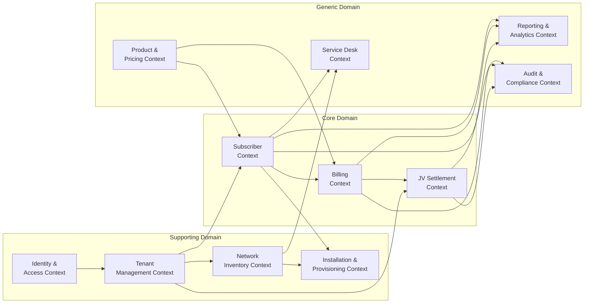
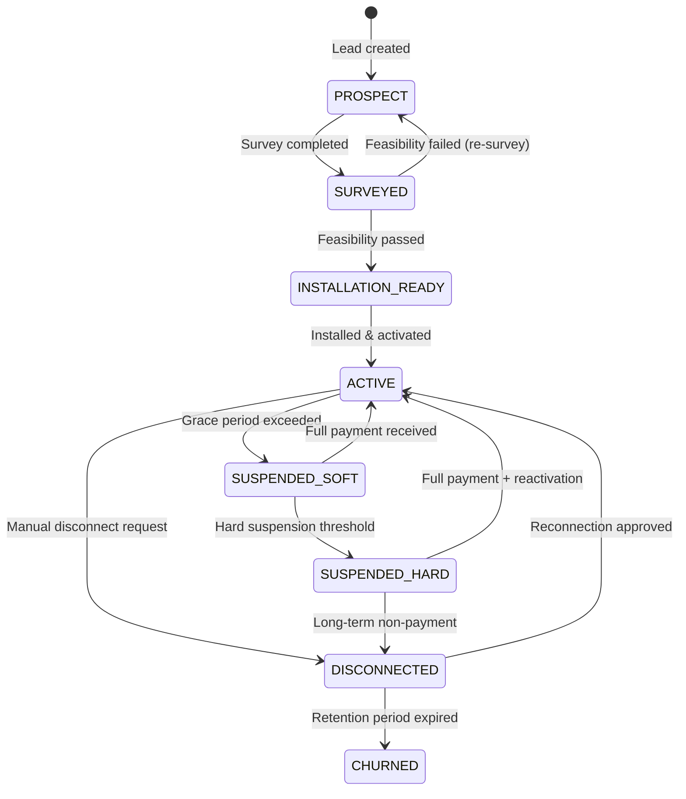
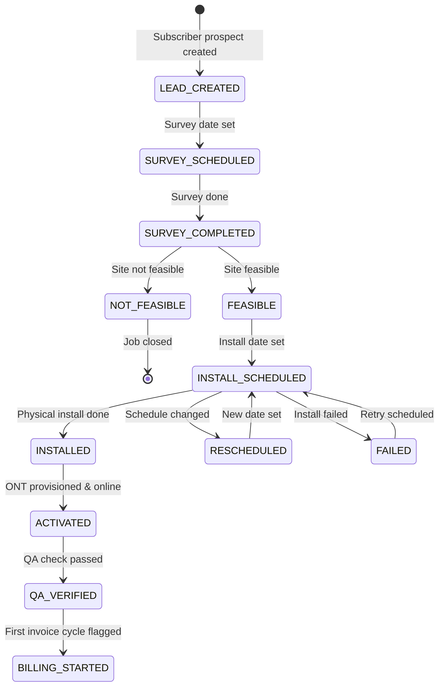
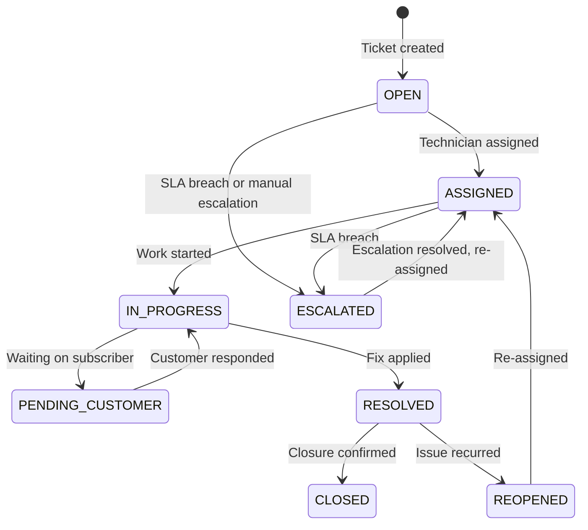
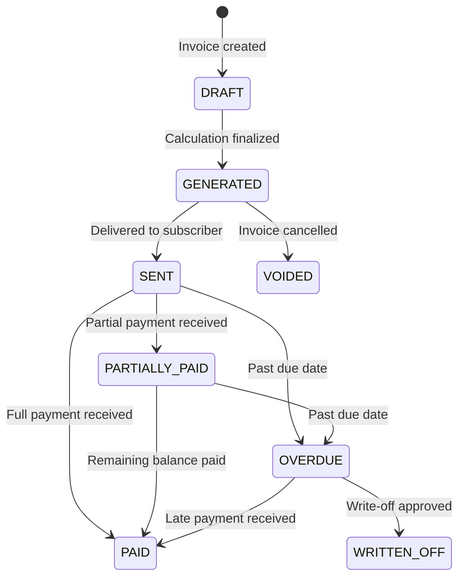
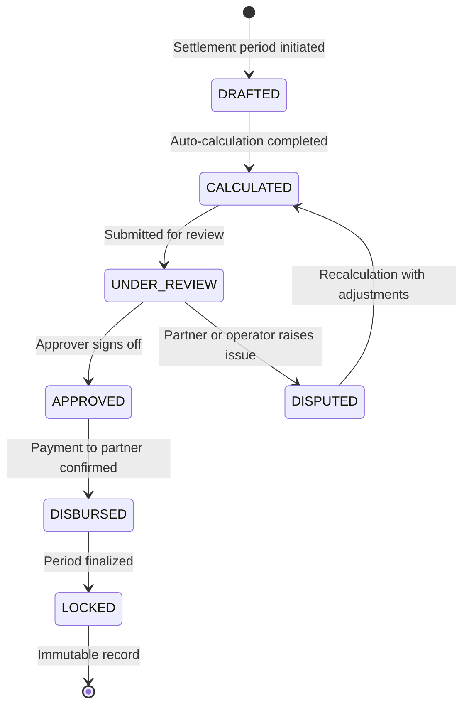

# Domain Model
## FiberOps PH – FTTH Barangay Multi-JV CRM / OSS-BSS Platform

**Document ID**: DOM-FOPS-001
**Version**: 1.0
**Date**: 2026-03-07

---

## 1. Bounded Context Map

---

## 2. Bounded Contexts – Detailed Breakdown

### 2.1 Identity & Access Context

**Purpose**: Manages users, authentication, roles, and permissions.

| Entity | Purpose | Key Attributes |
|--------|---------|---------------|
| User | System user account | id, email, password_hash, full_name, phone, status, last_login |
| Role | Named permission group | id, name, description, is_system_role |
| Permission | Granular access right | id, code, module, action, description |
| UserRole | User-to-role assignment | user_id, role_id |
| UserScope | User-to-barangay/partner assignment | user_id, barangay_id, partner_id |
| Session | Active login session | id, user_id, token_hash, ip_address, expires_at |

**Aggregate Root**: User

### 2.2 Tenant Management Context

**Purpose**: Manages the organizational hierarchy of barangays, JV partners, and their agreements.

| Entity | Purpose | Key Attributes |
|--------|---------|---------------|
| Barangay | Service area unit | id, name, municipality, province, region, status, coordinates |
| ServiceZone | Sub-division of barangay | id, barangay_id, name, description |
| Partner | JV partner entity | id, company_name, contact_person, phone, email, status |
| PartnerAgreement | Contract terms between operator and partner | id, partner_id, barangay_id, effective_date, end_date, status, version |
| RevenueShareRule | Calculation rules for a specific agreement | id, agreement_id, share_type (GROSS/NET), partner_percentage, deduction_buckets |

**Aggregate Root**: Barangay, PartnerAgreement

### 2.3 Subscriber Lifecycle Context

**Purpose**: Manages the complete subscriber lifecycle from prospect to churn.

| Entity | Purpose | Key Attributes |
|--------|---------|---------------|
| Subscriber | Customer account | id, account_number, full_name, phone, email, barangay_id, status |
| SubscriberAddress | Service location | id, subscriber_id, address_line, purok_sitio, geotag_lat, geotag_lng |
| Subscription | Active service assignment | id, subscriber_id, plan_id, start_date, end_date, status |

**Aggregate Root**: Subscriber

### 2.4 Network Inventory Context

**Purpose**: Models the physical FTTH network hierarchy and asset lifecycle.

| Entity | Purpose | Key Attributes |
|--------|---------|---------------|
| NetworkAsset | Generic asset record | id, asset_type_id, barangay_id, serial_number, status, parent_asset_id |
| NetworkAssetType | Asset classification | id, name (OLT, PON Port, Splitter, etc.), hierarchy_level |
| OltPort | OLT port details | id, asset_id, port_number, capacity, subscribers_connected |
| Splitter | Splitter details | id, asset_id, ratio, input_port_id, output_count |
| DistributionBox | Distribution point | id, asset_id, location, capacity |
| OntDevice | Customer premises device | id, asset_id, subscriber_id, mac_address, model |
| FiberSegment | Fiber cable segment | id, from_asset_id, to_asset_id, length_meters, type |

**Aggregate Root**: NetworkAsset

### 2.5 Installation & Provisioning Context

**Purpose**: Manages the installation workflow from lead to activation.

| Entity | Purpose | Key Attributes |
|--------|---------|---------------|
| InstallationJob | Work order for installation | id, subscriber_id, status, assigned_technician_id, scheduled_date |
| InstallationMaterial | Materials used | id, job_id, material_name, quantity, unit_cost |
| InstallationPhoto | Verification photos | id, job_id, photo_url, caption, stage |

**Aggregate Root**: InstallationJob

### 2.6 Service Desk Context

**Purpose**: Manages trouble tickets and field service operations.

| Entity | Purpose | Key Attributes |
|--------|---------|---------------|
| ServiceTicket | Trouble/service request | id, ticket_number, subscriber_id, category, priority, status, sla_due_date |
| TicketAssignment | Technician assignment | id, ticket_id, technician_id, assigned_at |
| TicketNote | Status updates and notes | id, ticket_id, author_id, content, is_internal |
| TicketFieldVisit | On-site visit record | id, ticket_id, technician_id, visit_date, findings, resolution |

**Aggregate Root**: ServiceTicket

### 2.7 Product & Pricing Context

**Purpose**: Manages service plans, pricing, and promotional offers.

| Entity | Purpose | Key Attributes |
|--------|---------|---------------|
| ServicePlan | Internet service tier | id, name, speed_mbps, monthly_fee, installation_fee, status |
| PlanFeature | Additional plan attributes | id, plan_id, feature_name, feature_value |
| Promo | Promotional discount | id, name, discount_amount, discount_percentage, valid_from, valid_to |
| Discount | Applied discount record | id, subscription_id, promo_id, months_remaining |

**Aggregate Root**: ServicePlan

### 2.8 Billing & Collections Context

**Purpose**: Manages invoicing, payments, account ledger, and financial records.

| Entity | Purpose | Key Attributes |
|--------|---------|---------------|
| BillingCycle | Monthly billing period | id, barangay_id, period_start, period_end, status, generated_at |
| Invoice | Subscriber bill | id, invoice_number, subscriber_id, billing_cycle_id, total_amount, status |
| InvoiceLine | Line item detail | id, invoice_id, description, amount, line_type (CHARGE/PENALTY/DISCOUNT/ADJUSTMENT) |
| Payment | Received payment | id, invoice_id, subscriber_id, amount, method, receipt_reference, posted_at |
| AccountLedger | Running balance record | id, subscriber_id, entry_type, amount, balance_after, reference_id, reference_type |
| Adjustment | Credit/debit adjustment | id, invoice_id, amount, reason_code, approved_by |
| WriteOff | Bad debt write-off | id, invoice_id, amount, reason, approved_by |

**Aggregate Root**: Invoice, AccountLedger

### 2.9 Settlement & JV Accounting Context

**Purpose**: Calculates and manages revenue sharing between operator and JV partners.

| Entity | Purpose | Key Attributes |
|--------|---------|---------------|
| Settlement | Period settlement record | id, agreement_id, period_start, period_end, status, total_revenue, partner_share, operator_share |
| SettlementLine | Detailed line items | id, settlement_id, line_type, amount, description |
| PartnerStatement | Generated statement document | id, settlement_id, generated_at, file_url |
| SettlementAdjustment | Manual corrections | id, settlement_id, amount, reason, approved_by |

**Aggregate Root**: Settlement

### 2.10 Reporting & Analytics Context

**Purpose**: Aggregates data from all contexts for dashboards, KPIs, and exports.

| Entity | Purpose | Key Attributes |
|--------|---------|---------------|
| DashboardWidget | Configured dashboard component | id, dashboard_type, widget_type, query_config |
| ExportedReport | Generated report record | id, report_type, generated_by, file_url, parameters |

**Aggregate Root**: N/A (read-only views)

### 2.11 Audit & Compliance Context

**Purpose**: Immutable record of all system mutations for compliance and forensics.

| Entity | Purpose | Key Attributes |
|--------|---------|---------------|
| AuditLog | Mutation record | id, entity_type, entity_id, action, actor_id, previous_value, new_value, timestamp |

**Aggregate Root**: AuditLog

---

## 3. Entity Lifecycle State Diagrams

### 3.1 Subscriber Lifecycle

### 3.2 Installation Job Lifecycle

### 3.3 Service Ticket Lifecycle

### 3.4 Invoice Lifecycle

### 3.5 Settlement Lifecycle

---

## 4. Key Relationship Narratives

### Subscriber → Network Path
A **Subscriber** is connected to the network through an **ONT/CPE** device, which connects via a **drop fiber** to a **Distribution Box**, which connects to a **Splitter**, which connects to a **PON Port** on an **OLT**. This full chain must be traceable from the subscriber record to the OLT port level.

### Barangay → JV Partner → Revenue
A **Barangay** may have one or more **Partners** through **Partner Agreements**. Each agreement defines **Revenue Share Rules** that determine how **collected revenue** (from the **Payments** context) is split during **Settlement** calculation. The settlement is scoped to the agreement's barangay and period.

### Subscriber → Billing → Settlement
A **Subscriber** generates **Invoices** through **Billing Cycles**. **Payments** posted against these invoices constitute **gross collections**. These collections feed into the **Settlement** calculation for the subscriber's barangay, where the partner's share is computed per the agreement's revenue share rules.

### Installation → Activation → Billing
An **Installation Job** transforms a **Subscriber** from PROSPECT to ACTIVE. Upon activation (QA_VERIFIED → BILLING_STARTED), the subscriber enters the next **Billing Cycle** and receives their first **Invoice**. The activation date determines prorating rules.

---

## 5. Aggregate Roots Summary

| Context | Aggregate Root | Owned Entities |
|---------|---------------|---------------|
| Identity & Access | User | UserRole, UserScope, Session |
| Tenant Management | Barangay | ServiceZone |
| Tenant Management | PartnerAgreement | RevenueShareRule |
| Subscriber Lifecycle | Subscriber | SubscriberAddress, Subscription |
| Network Inventory | NetworkAsset | OltPort, Splitter, DistributionBox, OntDevice, FiberSegment |
| Installation | InstallationJob | InstallationMaterial, InstallationPhoto |
| Service Desk | ServiceTicket | TicketAssignment, TicketNote, TicketFieldVisit |
| Product & Pricing | ServicePlan | PlanFeature, Promo |
| Billing | Invoice | InvoiceLine, Adjustment, WriteOff |
| Billing | AccountLedger | (standalone entries) |
| Settlement | Settlement | SettlementLine, SettlementAdjustment, PartnerStatement |
| Audit | AuditLog | (standalone entries) |
