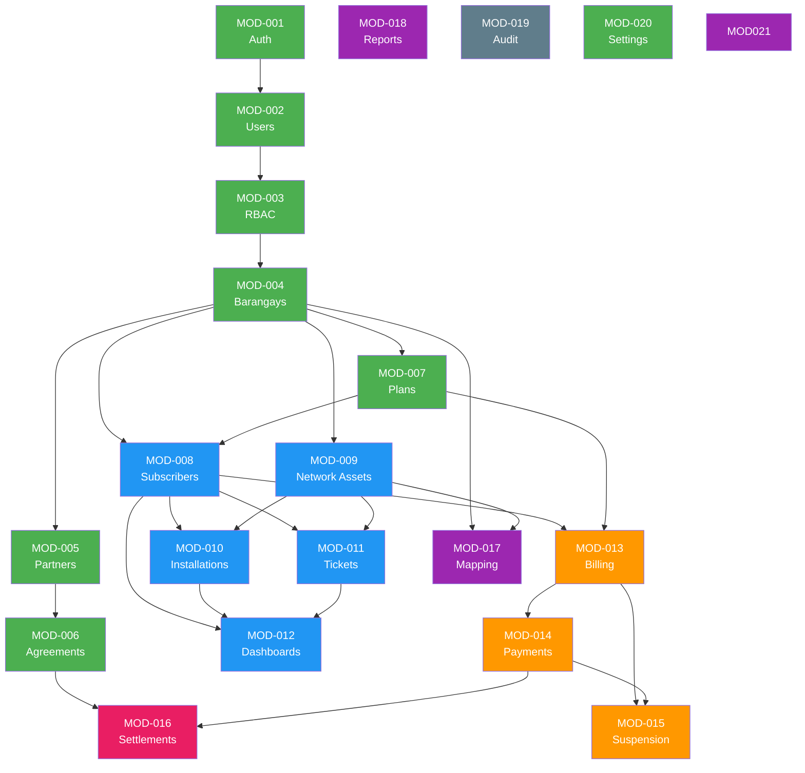

# Module Map
## FiberOps PH – FTTH Barangay Multi-JV CRM / OSS-BSS Platform

**Document ID**: MOD-FOPS-001
**Version**: 1.0
**Date**: 2026-03-07

---

## 1. Module Inventory

| Module ID | Module Name | Domain | Description | Phase | Dependencies | Primary Owner |
|-----------|------------|--------|-------------|:-----:|-------------|---------------|
| MOD-001 | Auth | Identity & Access | Login, token lifecycle, password management | 0 | — | Super Admin |
| MOD-002 | Users | Identity & Access | User CRUD, role assignment, scope assignment | 0 | MOD-001 | Super Admin |
| MOD-003 | RBAC | Identity & Access | Roles, permissions, permission groups | 0 | MOD-002 | Super Admin |
| MOD-004 | Barangays | Tenant Management | Barangay registry, service zones | 0 | MOD-003 | Corp Admin |
| MOD-005 | Partners | Tenant Management | JV partner entities | 0 | MOD-004 | Corp Admin |
| MOD-006 | Agreements | Tenant Management | JV agreements, revenue share templates | 0 | MOD-005 | Corp Admin |
| MOD-007 | Plans | Product & Pricing | Service plans, speed tiers, fees, promos | 0 | MOD-004 | Corp Admin |
| MOD-008 | Subscribers | Subscriber CRM | Subscriber lifecycle, profile, search | 1 | MOD-004, MOD-007 | Brgy Manager |
| MOD-009 | Network Assets | Network Inventory | FTTH asset hierarchy, status, capacity | 1 | MOD-004 | Network Eng |
| MOD-010 | Installations | Service Delivery | Installation workflow, job orders, technician assignment | 1 | MOD-008, MOD-009 | Ops Manager |
| MOD-011 | Tickets | Service Desk | Trouble tickets, SLA, dispatch, resolution | 1 | MOD-008, MOD-009 | CS Support |
| MOD-012 | Dashboards | Reporting | Operational dashboards (basic) | 1 | MOD-008, MOD-009, MOD-010, MOD-011 | Corp Admin |
| MOD-013 | Billing | Billing & Collection | Billing cycles, invoice generation, prorating | 2 | MOD-008, MOD-007 | Finance |
| MOD-014 | Payments | Billing & Collection | Payment posting, receipt tracking, ledger | 2 | MOD-013 | Collection |
| MOD-015 | Suspension | Account Management | Grace periods, soft/hard suspension, reactivation | 2 | MOD-013, MOD-014 | Finance |
| MOD-016 | Settlements | JV Commercial | Revenue share calculation, approval, statements | 3 | MOD-006, MOD-014 | Finance |
| MOD-017 | Mapping | Geographic | Map views, coordinates, topology visualization | 4 | MOD-004, MOD-009 | Network Eng |
| MOD-018 | Reports | Reporting | Advanced reports, KPIs, export | 4 | All | Corp Admin |
| MOD-019 | Audit | Compliance | Audit log framework, explorer, retention | 0+ | All | Auditor |
| MOD-020 | Settings | Configuration | System settings, master data, rule engine config | 0 | — | Super Admin |
| MOD-021 | Notifications | Communication | In-app and future SMS/email notifications | 4 | All | Ops Manager |

---

## 2. Module Dependency Diagram

**Legend**: 🟢 Phase 0 | 🔵 Phase 1 | 🟠 Phase 2 | 🔴 Phase 3 | 🟣 Phase 4 | ⚫ Cross-cutting

---

## 3. Module Interaction Matrix

| Source ↓ / Target → | Auth | Users | RBAC | Brgy | Partners | Agreements | Plans | Subscribers | Net Assets | Install | Tickets | Billing | Payments | Suspend | Settle | Audit |
|---------------------|:----:|:-----:|:----:|:----:|:--------:|:----------:|:-----:|:-----------:|:----------:|:-------:|:-------:|:-------:|:--------:|:-------:|:------:|:-----:|
| **Auth** | — | R | R | — | — | — | — | — | — | — | — | — | — | — | — | W |
| **Users** | R | — | RW | R | R | — | — | — | — | — | — | — | — | — | — | W |
| **Subscribers** | — | — | R | R | — | — | R | — | R | W | W | — | — | — | — | W |
| **Installations** | — | R | R | R | — | — | — | RW | RW | — | — | — | — | — | — | W |
| **Tickets** | — | R | R | R | — | — | — | R | R | — | — | — | — | — | — | W |
| **Billing** | — | — | R | R | — | — | R | R | — | — | — | — | W | W | — | W |
| **Payments** | — | — | R | R | — | — | — | R | — | — | — | RW | — | W | — | W |
| **Suspension** | — | — | R | — | — | — | — | RW | — | — | — | R | R | — | — | W |
| **Settlements** | — | — | R | R | R | R | — | — | — | — | — | R | R | — | — | W |
| **Dashboards** | — | — | R | R | R | — | — | R | R | R | R | R | R | R | R | — |

**Legend**: R = reads from, W = writes to, RW = reads and writes
