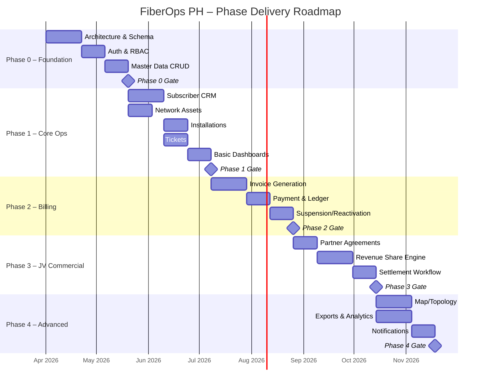
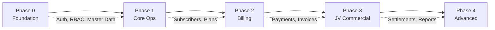

# Phase Delivery Strategy
## FiberOps PH – FTTH Barangay Multi-JV CRM / OSS-BSS Platform

**Document ID**: PHS-FOPS-001
**Version**: 1.0
**Date**: 2026-03-07

---

## 1. Phase Overview

---

## 2. Phase 0 – Foundation

### Scope
Build the platform skeleton, authentication system, role-based access control, and master data management.

### Deliverables

| Item | Description | Module(s) |
|------|-------------|----------|
| Project scaffold | Monorepo with Next.js frontend + NestJS/Fastify backend + Prisma + Postgres | MOD-020 |
| Database schema v1 | Core tables: users, roles, permissions, barangays, partners, agreements, plans | All |
| Auth system | Login, JWT tokens, refresh, password reset, session management | MOD-001 |
| RBAC engine | Role assignment, permission checking guards, scope enforcement middleware | MOD-002, MOD-003 |
| Barangay CRUD | Create/read/update barangay service areas | MOD-004 |
| Partner CRUD | Create/read/update JV partner entities | MOD-005 |
| Agreement CRUD | Create/read/update agreements with revenue share templates | MOD-006 |
| Plan CRUD | Create/read/update service plans with pricing | MOD-007 |
| Settings | System configuration management UI | MOD-020 |
| Audit framework | Audit log middleware wired to all mutations | MOD-019 |
| Seed data | Default roles/permissions, asset types, ticket categories | — |
| Docker setup | docker-compose for local development (Postgres, Redis, API, Web) | — |

### Dependencies
- None (foundation phase)

### Acceptance Gate

| Criteria | Verification |
|----------|-------------|
| All 12 user roles seeded | Query roles table, count = 12 |
| Login/logout works | E2E test: login → dashboard redirect → logout |
| RBAC enforced | API test: Brgy Manager cannot access partner endpoints |
| Tenant scoping works | API test: Brgy Manager sees only assigned barangay data |
| Master data CRUD functional | E2E test: create barangay → create partner → create agreement |
| Audit logs created | Verify audit records for all create/update/delete operations |
| Docker stack starts clean | `docker-compose up` succeeds with zero errors |

### Test Coverage Requirements
- Auth module: 90%+ coverage
- RBAC guards: 100% coverage
- Master data services: 80%+ coverage

---

## 3. Phase 1 – Core Operations

### Scope
Build subscriber management, network asset registry, installation workflow, ticketing system, and basic dashboards.

### Deliverables

| Item | Description | Module(s) |
|------|-------------|----------|
| Subscriber CRUD | Full lifecycle management: create, view, edit, search, filter, status changes | MOD-008 |
| Subscriber list/detail | List with filtering, detail page with tabs | MOD-008 |
| Network asset hierarchy | OLT → PON → Splitter → DistBox → ONT registration and linking | MOD-009 |
| Asset-to-subscriber linking | Assign ONT/CPE to subscriber, link to network path | MOD-009 |
| Installation workflow | Job orders, technician assignment, status tracking (lead → activated) | MOD-010 |
| Survey and activation forms | Data capture for survey results and activation confirmation | MOD-010 |
| Ticket management | Create, assign, update, resolve tickets with SLA tracking | MOD-011 |
| Dispatch board | Visual board showing technician assignments and ticket status | MOD-011 |
| Basic dashboards | Subscriber count, installation pipeline, ticket summary per barangay | MOD-012 |
| Subscriber search | Global search by account number, name, or phone | MOD-008 |

### Dependencies
- Phase 0 must be fully accepted

### Acceptance Gate

| Criteria | Verification |
|----------|-------------|
| Subscriber lifecycle works end-to-end | E2E: create → survey → install → activate → view on dashboard |
| Network hierarchy navigable | UI test: click through OLT → port → splitter → box → ONT |
| Subscriber linked to network path | Detail page shows full network path from subscriber to OLT |
| Tickets created and resolved | E2E: create ticket → assign → resolve → close |
| Dashboards show correct totals | Verify counts match underlying data |
| Tenant scoping on all new entities | API test: data isolation between barangays |

### Test Coverage Requirements
- Subscriber service: 85%+ coverage
- Installation workflow: 80%+ coverage (all state transitions)
- Ticket lifecycle: 80%+ coverage

---

## 4. Phase 2 – Billing

### Scope
Build the billing engine, payment processing, account ledger, and suspension/reactivation rules.

### Deliverables

| Item | Description | Module(s) |
|------|-------------|----------|
| Billing cycle setup | Configure monthly cycles with cutoff dates | MOD-013 |
| Invoice generation | Automated invoice creation with correct calculations | MOD-013 |
| Prorated billing | Mid-cycle activation and plan changes | MOD-013 |
| Payment posting | Record payments with method, amount, receipt reference | MOD-014 |
| Account ledger | Running balance per subscriber with all financial entries | MOD-014 |
| Late penalties | Automatic penalty calculation on overdue invoices | MOD-013 |
| Adjustments | Credit/debit adjustments with reason codes and approval | MOD-013 |
| Invoice aging report | Aging buckets: current, 30, 60, 90, 120+ days | MOD-013 |
| Suspension queue | List of accounts pending suspension | MOD-015 |
| Suspension engine | Grace period → soft suspend → hard suspend rule engine | MOD-015 |
| Auto-reactivation | Automatic reactivation upon full payment with optional fee | MOD-015 |

### Dependencies
- Phase 1 must be fully accepted (especially Subscribers and Plans)

### Acceptance Gate

| Criteria | Verification |
|----------|-------------|
| Invoice generated with correct amount | Calculation test: monthly fee + prorating + penalties = correct total |
| Payment updates ledger and invoice status | Post payment → verify ledger entry + invoice status change |
| Aging report accurate | Generate invoices at various dates → verify aging bucket placement |
| Suspension triggers at correct threshold | Create overdue account → verify suspension at configured day threshold |
| Reactivation works on payment | Pay suspended account → verify status returns to ACTIVE |
| All financial mutations audited | Verify audit log entries for invoice, payment, adjustment, suspension |

### Test Coverage Requirements
- Billing calculation service: **95%+ coverage** (financial accuracy is critical)
- Suspension rule engine: 90%+ coverage
- Payment posting: 90%+ coverage

---

## 5. Phase 3 – JV Commercial Layer

### Scope
Build the JV revenue sharing engine, settlement workflow, and partner statement generation.

### Deliverables

| Item | Description | Module(s) |
|------|-------------|----------|
| Agreement configuration UI | Enhanced agreement management with revenue share templates | MOD-006 |
| Revenue share calculation engine | Gross and net basis formulas with configurable deductions | MOD-016 |
| Settlement run | Monthly auto-calculation of partner shares per agreement | MOD-016 |
| Settlement approval workflow | Calculate → review → approve → disburse → lock | MOD-016 |
| Manual adjustments | Adjustments with approval workflow | MOD-016 |
| Partner statement | Generated statement with detail lines | MOD-016 |
| Partner statement export | CSV/PDF export of settlement statements | MOD-016 |
| Settlement history | Historical view with locked period protection | MOD-016 |

### Dependencies
- Phase 2 must be fully accepted (Payments are source data for settlements)

### Acceptance Gate

| Criteria | Verification |
|----------|-------------|
| Settlement = sum of payments × share percentage | Calculation test with known data: verify to the centavo |
| Net basis formula deducts correctly | Test: gross - deductions × percentage = partner share |
| Locked periods immutable | Attempt to modify locked settlement → verify rejection |
| Approval workflow enforced | Non-authorized role cannot approve → verify access denied |
| Statement export downloads correctly | Export settlement → verify file contains correct data |
| Historical agreement versions preserved | Change agreement → verify old version still accessible |

### Test Coverage Requirements
- Revenue share calculation: **100% coverage** (zero tolerance for financial errors)
- Settlement workflow: 90%+ coverage
- Agreement versioning: 85%+ coverage

---

## 6. Phase 4 – Advanced Operations

### Scope
Enhanced map views, advanced reporting/exports, analytics, and notification framework.

### Deliverables

| Item | Description | Module(s) |
|------|-------------|----------|
| Map visualization | Service address plotting, barangay boundaries, subscriber density | MOD-017 |
| Asset location map | Network asset points on map with status indicators | MOD-017 |
| Advanced reports | Revenue by barangay/partner, ARPU, churn, install turnaround | MOD-018 |
| CSV/Excel export | Export functionality for all major list views and reports | MOD-018 |
| KPI explorer | Interactive KPI dashboard with drill-down | MOD-018 |
| Notification framework | In-app notification engine (base for future SMS/email) | MOD-021 |
| Analytics dashboards | Trend charts, comparisons, projected metrics | MOD-012 |

### Dependencies
- Phase 3 must be fully accepted

### Acceptance Gate

| Criteria | Verification |
|----------|-------------|
| Map shows subscriber locations | Plot known coordinates → verify markers visible |
| Reports match underlying data | Generate report → verify totals against direct queries |
| Export produces valid files | Download CSV/Excel → open in spreadsheet → verify data |
| KPIs calculate correctly | ARPU, churn rate, turnaround time → verify formulas |
| Notifications delivered in-app | Trigger event → verify notification appears for target user |

### Test Coverage Requirements
- Report calculations: 80%+ coverage
- Export generation: 75%+ coverage

---

## 7. Phase Dependencies Matrix

> **Strictly sequential**: Each phase must pass its acceptance gate before the next phase begins. No Phase 2 billing code can be written until Phase 1 subscriber management is accepted.

---

## 8. Risk Register

| Risk ID | Phase | Risk | Impact | Likelihood | Mitigation |
|---------|:-----:|------|--------|:----------:|-----------|
| RSK-001 | 0 | Schema changes late in Phase 0 cascade to all phases | High | Medium | Freeze schema after Phase 0 gate; use migrations for changes |
| RSK-002 | 1 | Network asset hierarchy too rigid for real-world topologies | Medium | Medium | Allow generic parent-child relationships; avoid hardcoded levels |
| RSK-003 | 2 | Billing calculation edge cases (prorating, partial months) | High | High | Write exhaustive test cases before implementation; use DECIMAL precision |
| RSK-004 | 3 | Revenue share formulas ambiguous across different JV agreements | High | Medium | Model as configurable rules; validate with partner-provided examples |
| RSK-005 | All | Scope creep from Phase 2+ features into earlier phases | Medium | High | Strict phase gates; Master Orchestrator reviews every merge |
| RSK-006 | All | Tenant data leakage between barangays | Critical | Low | Scoping middleware on every API route; automated scope tests |
| RSK-007 | 2-3 | Financial calculation rounding errors | High | Medium | Use DECIMAL(18,2); never FLOAT; round at display, not storage |

---

## 9. Resource Assumptions

| Phase | Duration Estimate | Assumed Team |
|:-----:|:-----------------:|-------------|
| 0 | 7 weeks | 1 lead developer + 1 junior developer |
| 1 | 9 weeks | 2 developers + 1 QA |
| 2 | 7 weeks | 2 developers + 1 QA |
| 3 | 7 weeks | 2 developers + 1 QA + 1 finance reviewer |
| 4 | 8 weeks | 2 developers + 1 QA |

> **Total estimated duration**: ~38 weeks (~9.5 months) with sequential phase execution
>
> **Note**: Durations assume no major rework. Parallel streams within each phase can reduce timelines.
