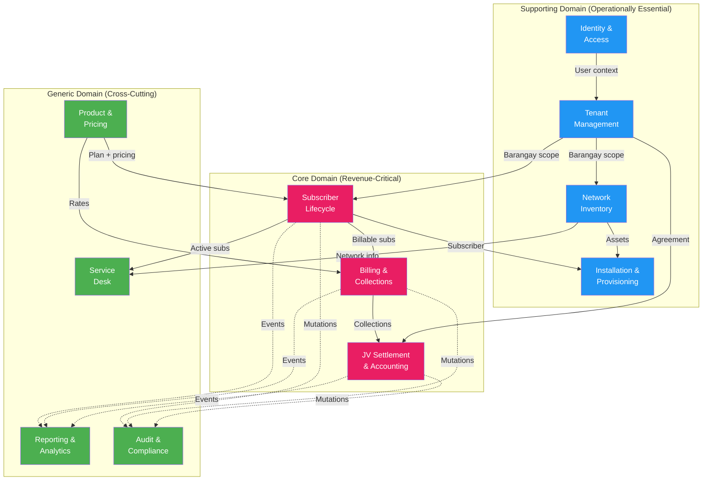

# Bounded Context / Domain Breakdown
## FiberOps PH – FTTH Barangay Multi-JV CRM / OSS-BSS Platform

**Document ID**: BND-FOPS-001
**Version**: 1.0
**Date**: 2026-03-07

---

## 1. Context Map

**Legend**: 🔴 Core Domain | 🔵 Supporting Domain | 🟢 Generic Domain

---

## 2. Bounded Context Specifications

### 2.1 Identity & Access Context

| Attribute | Value |
|-----------|-------|
| **Purpose** | Authentication, authorization, user management, and session control |
| **Aggregate Root** | User |
| **Owned Entities** | User, Role, Permission, UserRole, UserScope, Session |
| **Events Published** | `user.created`, `user.updated`, `user.deactivated`, `user.login`, `user.login_failed`, `user.password_reset` |
| **Events Consumed** | None |
| **Anti-Corruption** | None — upstream dependency for all other contexts |

**Domain Rules**:
- Password must meet complexity requirements (min 8 chars, mixed case, digit)
- Account locks after 5 failed login attempts within 15 minutes
- Sessions expire after configurable idle timeout
- Role changes take effect on next token refresh

---

### 2.2 Tenant Management Context

| Attribute | Value |
|-----------|-------|
| **Purpose** | Organizational structure: barangays, partners, JV agreements |
| **Aggregate Roots** | Barangay, PartnerAgreement |
| **Owned Entities** | Barangay, ServiceZone, Partner, PartnerAgreement, RevenueShareRule |
| **Events Published** | `barangay.created`, `barangay.updated`, `partner.created`, `agreement.created`, `agreement.updated`, `agreement.version_changed` |
| **Events Consumed** | None |
| **Anti-Corruption** | None — master data provider |

**Domain Rules**:
- Barangay names unique within the system
- An agreement must have at least one revenue share rule
- Agreement version changes create new version records; old versions preserved
- Agreement effective dates must not overlap for same barangay-partner pair

---

### 2.3 Subscriber Lifecycle Context

| Attribute | Value |
|-----------|-------|
| **Purpose** | Complete subscriber record management and lifecycle state transitions |
| **Aggregate Root** | Subscriber |
| **Owned Entities** | Subscriber, SubscriberAddress, Subscription |
| **Events Published** | `subscriber.created`, `subscriber.status_changed`, `subscriber.plan_changed`, `subscriber.activated`, `subscriber.suspended`, `subscriber.disconnected` |
| **Events Consumed** | `payment.posted` (for reactivation check), `suspension.executed` (status update) |
| **Anti-Corruption** | Receives plan details from Product context; owns subscription record |

**Domain Rules**:
- Account numbers generated per barangay convention (e.g., `BRGY-001-00001`)
- Status transitions follow strict state machine (see Domain Model)
- A subscriber must belong to exactly one barangay
- Active status requires a valid subscription with an active plan

---

### 2.4 Network Inventory Context

| Attribute | Value |
|-----------|-------|
| **Purpose** | FTTH network asset hierarchy, capacity tracking, and subscriber-to-network linkage |
| **Aggregate Root** | NetworkAsset |
| **Owned Entities** | NetworkAsset, NetworkAssetType, OltPort, Splitter, DistributionBox, OntDevice, FiberSegment |
| **Events Published** | `asset.created`, `asset.status_changed`, `asset.linked_subscriber`, `asset.capacity_threshold` |
| **Events Consumed** | `subscriber.activated` (link ONT), `subscriber.disconnected` (unlink ONT) |
| **Anti-Corruption** | Does not own subscriber data; only references subscriber_id on ONT assignment |

**Domain Rules**:
- Asset hierarchy must be maintained: parent-child relationships (OLT → port → splitter → box → ONT)
- Capacity cannot be exceeded — linking fails if parent asset is at capacity
- Serial numbers unique per asset type
- OLT port utilization = count of connected subscribers / port capacity

---

### 2.5 Installation & Provisioning Context

| Attribute | Value |
|-----------|-------|
| **Purpose** | Manages the workflow from subscriber lead through activated service |
| **Aggregate Root** | InstallationJob |
| **Owned Entities** | InstallationJob, InstallationMaterial, InstallationPhoto |
| **Events Published** | `installation.survey_completed`, `installation.installed`, `installation.activated`, `installation.failed`, `installation.rescheduled` |
| **Events Consumed** | `subscriber.created` (auto-create lead job) |
| **Anti-Corruption** | References subscriber and network assets; does not modify them directly (emits events for state changes) |

**Domain Rules**:
- Each subscriber can have at most one active installation job
- Technician assignment required before status can change to INSTALL_SCHEDULED
- Failed installations require a reason code
- Activation triggers `subscriber.activated` event (consumed by Subscriber, Billing contexts)

---

### 2.6 Service Desk Context

| Attribute | Value |
|-----------|-------|
| **Purpose** | Trouble ticket management, SLA tracking, field service dispatch |
| **Aggregate Root** | ServiceTicket |
| **Owned Entities** | ServiceTicket, TicketAssignment, TicketNote, TicketFieldVisit |
| **Events Published** | `ticket.created`, `ticket.assigned`, `ticket.resolved`, `ticket.closed`, `ticket.escalated`, `ticket.sla_breached` |
| **Events Consumed** | `subscriber.status_changed` (auto-close tickets if subscriber disconnected) |
| **Anti-Corruption** | References subscriber and network assets by ID; enriches display data via service calls |

**Domain Rules**:
- Ticket numbers auto-generated (e.g., `TKT-2026-00001`)
- SLA due date calculated from priority level (P1: 4h, P2: 8h, P3: 24h, P4: 72h)
- SLA breach event emitted when due date passes without resolution
- Tickets cannot be closed without resolution notes and closure code

---

### 2.7 Product & Pricing Context

| Attribute | Value |
|-----------|-------|
| **Purpose** | Service plan catalog, pricing, and promotional offers |
| **Aggregate Root** | ServicePlan |
| **Owned Entities** | ServicePlan, PlanFeature, Promo, Discount |
| **Events Published** | `plan.created`, `plan.updated`, `plan.deactivated`, `promo.created` |
| **Events Consumed** | None |
| **Anti-Corruption** | None — read-only reference for Subscriber and Billing contexts |

**Domain Rules**:
- Plan deactivation does not affect existing subscriptions (grandfathered)
- Price changes apply to new subscriptions only; existing subscriptions retain their rate until renewal
- Promo discounts have start and end dates; auto-expire

---

### 2.8 Billing & Collections Context

| Attribute | Value |
|-----------|-------|
| **Purpose** | Invoice generation, payment processing, account ledger, and aging |
| **Aggregate Roots** | Invoice, AccountLedger |
| **Owned Entities** | BillingCycle, Invoice, InvoiceLine, Payment, AccountLedger, Adjustment, WriteOff |
| **Events Published** | `invoice.generated`, `invoice.overdue`, `payment.posted`, `payment.reversed`, `adjustment.applied`, `writeoff.approved` |
| **Events Consumed** | `subscriber.activated` (start billing), `subscriber.plan_changed` (prorate), `installation.activated` (first invoice) |
| **Anti-Corruption** | Gets plan rates from Product context; gets subscriber list from Subscriber context; does not modify subscriber status directly |

**Domain Rules**:
- All monetary values stored as DECIMAL(18,2) — never FLOAT
- Invoice amounts must be reconstructible: sum of line items = total
- Payment posting follows FIFO (oldest invoice first)
- Overpayment creates credit balance on account ledger
- Adjustments and write-offs require reason codes
- Write-offs above configurable threshold require approval

---

### 2.9 Settlement & JV Accounting Context

| Attribute | Value |
|-----------|-------|
| **Purpose** | Revenue sharing calculation, settlement workflow, and partner statements |
| **Aggregate Root** | Settlement |
| **Owned Entities** | Settlement, SettlementLine, PartnerStatement, SettlementAdjustment |
| **Events Published** | `settlement.calculated`, `settlement.submitted`, `settlement.approved`, `settlement.disbursed`, `settlement.locked` |
| **Events Consumed** | `payment.posted` (accumulate collections), `agreement.version_changed` (update calculation rules) |
| **Anti-Corruption** | Gets payment totals from Billing context; gets agreement terms from Tenant context; never modifies payments or agreements |

**Domain Rules**:
- Settlement calculations are idempotent — re-running for same period produces same result
- Locked settlements cannot be modified (period finalized)
- Manual adjustments require explicit approval
- Partner share must equal gross/net revenue × configured percentage (to the centavo)
- Historical recalculation only allowed by unlocking period (Super Admin + audit log)

---

### 2.10 Reporting & Analytics Context

| Attribute | Value |
|-----------|-------|
| **Purpose** | Aggregated dashboards, KPIs, and exportable reports |
| **Aggregate Root** | None (read-only projection) |
| **Owned Entities** | DashboardWidget, ExportedReport |
| **Events Published** | `report.generated`, `report.exported` |
| **Events Consumed** | All domain events (for real-time dashboard refresh triggers) |
| **Anti-Corruption** | Read-only access to all other contexts via service calls or materialized views |

**Domain Rules**:
- Reports are point-in-time snapshots; not live queries
- Export files stored as attachments with expiry
- Dashboard cache TTL: 2 minutes (acceptable staleness for operational dashboards)

---

### 2.11 Audit & Compliance Context

| Attribute | Value |
|-----------|-------|
| **Purpose** | Immutable record of all system mutations for compliance |
| **Aggregate Root** | AuditLog |
| **Owned Entities** | AuditLog |
| **Events Published** | None (terminal consumer) |
| **Events Consumed** | All mutation events from all contexts |
| **Anti-Corruption** | Write-only access; no context depends on audit data for business logic |

**Domain Rules**:
- Audit logs are append-only — no UPDATE or DELETE allowed
- Every audit entry includes: actor, action, entity, before/after values, timestamp, source module
- Sensitive data (passwords, tokens) is never logged
- Retention policy: 7 years for financial records, 3 years for operational records
