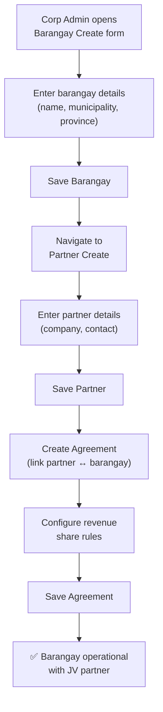
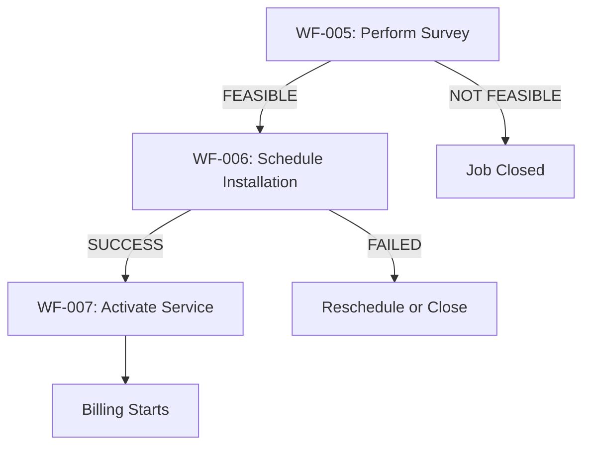

# Event / Workflow Architecture
## FiberOps PH – FTTH Barangay Multi-JV CRM / OSS-BSS Platform

**Document ID**: EVT-FOPS-001
**Version**: 1.0
**Date**: 2026-03-07

---

## 1. Domain Events Catalog

### 1.1 Identity & Access Events

| Event ID | Event Name | Source | Payload | Consumers |
|----------|-----------|--------|---------|-----------|
| EVT-IAM-001 | `user.created` | Users Module | userId, email, roles, barangayIds | Audit |
| EVT-IAM-002 | `user.updated` | Users Module | userId, changedFields | Audit |
| EVT-IAM-003 | `user.deactivated` | Users Module | userId, reason | Audit, Sessions (revoke) |
| EVT-IAM-004 | `user.login` | Auth Module | userId, ip, timestamp | Audit |
| EVT-IAM-005 | `user.login_failed` | Auth Module | email, ip, attemptCount | Audit, Security (lockout check) |
| EVT-IAM-006 | `user.password_reset` | Auth Module | userId | Audit |

### 1.2 Tenant Management Events

| Event ID | Event Name | Source | Payload | Consumers |
|----------|-----------|--------|---------|-----------|
| EVT-TEN-001 | `barangay.created` | Barangays Module | barangayId, name | Audit, Cache (invalidate) |
| EVT-TEN-002 | `partner.created` | Partners Module | partnerId, name | Audit, Cache |
| EVT-TEN-003 | `agreement.created` | Agreements Module | agreementId, partnerId, barangayId, shareRules | Audit |
| EVT-TEN-004 | `agreement.version_changed` | Agreements Module | agreementId, oldVersion, newVersion | Audit, Settlements (recalc check) |

### 1.3 Subscriber Events

| Event ID | Event Name | Source | Payload | Consumers |
|----------|-----------|--------|---------|-----------|
| EVT-SUB-001 | `subscriber.created` | Subscribers Module | subscriberId, barangayId, status=PROSPECT | Audit, Installations (auto-create lead) |
| EVT-SUB-002 | `subscriber.status_changed` | Subscribers Module | subscriberId, oldStatus, newStatus, reason | Audit, Notifications |
| EVT-SUB-003 | `subscriber.activated` | Subscribers Module | subscriberId, planId, activationDate | Billing (start billing), Network (link ONT), Audit |
| EVT-SUB-004 | `subscriber.suspended` | Subscribers Module | subscriberId, suspensionType, reason | Audit, Notifications, Network (throttle/disable) |
| EVT-SUB-005 | `subscriber.disconnected` | Subscribers Module | subscriberId, reason | Audit, Network (unlink ONT), Tickets (auto-close) |
| EVT-SUB-006 | `subscriber.plan_changed` | Subscribers Module | subscriberId, oldPlanId, newPlanId, effectiveDate | Billing (prorate), Audit |

### 1.4 Installation Events

| Event ID | Event Name | Source | Payload | Consumers |
|----------|-----------|--------|---------|-----------|
| EVT-INS-001 | `installation.survey_completed` | Installations Module | jobId, subscriberId, feasibility | Audit, Notifications (subscriber) |
| EVT-INS-002 | `installation.installed` | Installations Module | jobId, subscriberId, technicianId, materialsUsed | Audit |
| EVT-INS-003 | `installation.activated` | Installations Module | jobId, subscriberId, activationDate | Subscribers (status → ACTIVE), Billing, Audit |
| EVT-INS-004 | `installation.failed` | Installations Module | jobId, subscriberId, reason | Audit, Notifications (ops manager) |
| EVT-INS-005 | `installation.rescheduled` | Installations Module | jobId, oldDate, newDate, reason | Audit |

### 1.5 Ticket Events

| Event ID | Event Name | Source | Payload | Consumers |
|----------|-----------|--------|---------|-----------|
| EVT-TKT-001 | `ticket.created` | Tickets Module | ticketId, subscriberId, category, priority | Audit, Notifications (dispatch) |
| EVT-TKT-002 | `ticket.assigned` | Tickets Module | ticketId, technicianId | Audit, Notifications (technician) |
| EVT-TKT-003 | `ticket.resolved` | Tickets Module | ticketId, resolutionCode, notes | Audit |
| EVT-TKT-004 | `ticket.closed` | Tickets Module | ticketId, closureCode | Audit |
| EVT-TKT-005 | `ticket.escalated` | Tickets Module | ticketId, reason, escalatedTo | Audit, Notifications |
| EVT-TKT-006 | `ticket.sla_breached` | Tickets Module | ticketId, slaDueDate, currentStatus | Audit, Notifications (ops manager) |

### 1.6 Billing Events

| Event ID | Event Name | Source | Payload | Consumers |
|----------|-----------|--------|---------|-----------|
| EVT-BIL-001 | `invoice.generated` | Billing Module | invoiceId, subscriberId, amount, cycleId | Audit |
| EVT-BIL-002 | `invoice.overdue` | Billing Module | invoiceId, subscriberId, daysOverdue, amount | Suspension (check thresholds), Audit, Notifications |
| EVT-BIL-003 | `payment.posted` | Payments Module | paymentId, subscriberId, invoiceId, amount, method | Suspension (check reactivation), Settlements (accumulate), Audit |
| EVT-BIL-004 | `payment.reversed` | Payments Module | paymentId, reason | Billing (revert invoice status), Audit |
| EVT-BIL-005 | `adjustment.applied` | Billing Module | adjustmentId, invoiceId, amount, reason | Audit |
| EVT-BIL-006 | `writeoff.approved` | Billing Module | writeoffId, invoiceId, amount, approvedBy | Audit |

### 1.7 Settlement Events

| Event ID | Event Name | Source | Payload | Consumers |
|----------|-----------|--------|---------|-----------|
| EVT-SET-001 | `settlement.calculated` | Settlements Module | settlementId, agreementId, period, totalRevenue, partnerShare | Audit |
| EVT-SET-002 | `settlement.submitted` | Settlements Module | settlementId, submittedBy | Audit, Notifications (approver) |
| EVT-SET-003 | `settlement.approved` | Settlements Module | settlementId, approvedBy | Audit, Notifications (partner) |
| EVT-SET-004 | `settlement.disbursed` | Settlements Module | settlementId, disbursedAmount | Audit |
| EVT-SET-005 | `settlement.locked` | Settlements Module | settlementId, period | Audit |

---

## 2. Workflow Definitions

### WF-001: Create Barangay + Assign JV Partner



| Attribute | Value |
|-----------|-------|
| **Actors** | Corporate Admin |
| **Entry** | New barangay to be onboarded |
| **Validations** | Unique barangay name; partner entity must exist before agreement; at least one share rule required |
| **Outputs** | Barangay record, Partner record, Agreement with rules |
| **Exceptions** | Duplicate barangay name → error; missing share rules → cannot save agreement |
| **Audit** | `barangay.created`, `partner.created`, `agreement.created` |

---

### WF-002: Configure Partner Agreement + Revenue Share Rules

| Attribute | Value |
|-----------|-------|
| **Actors** | Corporate Admin, Finance Officer |
| **Entry** | Partner and barangay already exist |
| **Steps** | 1. Select barangay+partner → 2. Set agreement effective dates → 3. Choose share type (GROSS/NET) → 4. Set percentage → 5. Define deduction buckets (if NET) → 6. Save |
| **Validations** | Percentage ≤ 100; effective dates non-overlapping; deduction buckets required for NET basis |
| **Outputs** | PartnerAgreement + RevenueShareRule records |
| **Audit** | `agreement.created` or `agreement.version_changed` |

---

### WF-003: Add Service Plans

| Attribute | Value |
|-----------|-------|
| **Actors** | Corporate Admin |
| **Steps** | 1. Enter plan name, speed, monthly fee, install fee → 2. Add features → 3. Set status to ACTIVE → 4. Save |
| **Validations** | Plan name unique; monthly fee > 0; speed > 0 |
| **Audit** | `plan.created` |

---

### WF-004: Encode Subscriber Lead

| Attribute | Value |
|-----------|-------|
| **Actors** | Barangay Manager, CS Support |
| **Steps** | 1. Enter subscriber details → 2. Set service address + geotagging → 3. Select plan → 4. Save as PROSPECT |
| **Validations** | Required fields; valid barangay association; plan must be active |
| **Outputs** | Subscriber (PROSPECT), auto-created InstallationJob (LEAD_CREATED) |
| **Audit** | `subscriber.created` |

---

### WF-005 through WF-007: Survey → Install → Activate



**WF-005: Perform Survey**
- **Actors**: Field Technician, Barangay Manager
- **Steps**: 1. Visit site → 2. Assess feasibility (fiber path, equipment) → 3. Record findings → 4. Upload photos → 5. Mark feasible/not feasible
- **Output**: Job status → SURVEY_COMPLETED + feasibility result

**WF-006: Schedule Installation**
- **Actors**: Operations Manager
- **Steps**: 1. Review feasible jobs → 2. Assign technician → 3. Set installation date → 4. Mark scheduled → 5. Technician installs → 6. Record materials used → 7. Mark installed
- **Exception**: Failed install → log reason → reschedule or close

**WF-007: Activate Service**
- **Actors**: Network Engineer, Operations Manager
- **Steps**: 1. Verify physical install → 2. Provision ONT → 3. Assign network path (ONT → DistBox → Splitter → PON → OLT) → 4. QA verify → 5. Activate
- **Output**: Subscriber status → ACTIVE; Installation → BILLING_STARTED
- **Events Emitted**: `installation.activated` → `subscriber.activated` → triggers Billing context

---

### WF-008: Start Billing

| Attribute | Value |
|-----------|-------|
| **Trigger** | `subscriber.activated` event |
| **Actors** | System (automated), Finance Officer (oversight) |
| **Steps** | 1. Determine billing cycle for subscriber's barangay → 2. Calculate prorated amount for first partial month → 3. Generate first invoice → 4. Update account ledger |
| **Validations** | Active subscription with valid plan required; activation date determines prorate |
| **Audit** | `invoice.generated` |

---

### WF-009: Record Payment

| Attribute | Value |
|-----------|-------|
| **Actors** | Collection Officer |
| **Steps** | 1. Search subscriber → 2. View outstanding invoices → 3. Enter payment amount and method → 4. Enter receipt reference → 5. Post payment |
| **Business Rules** | FIFO application (oldest invoice first); partial payment allowed; overpayment creates credit |
| **Outputs** | Payment record, updated invoice status, updated ledger balance |
| **Events** | `payment.posted` → triggers reactivation check if subscriber is suspended |
| **Audit** | `payment.posted` |

---

### WF-010: Suspend Unpaid Account

| Attribute | Value |
|-----------|-------|
| **Trigger** | Daily cron job checks overdue invoices |
| **Steps** | 1. Find invoices past grace period → 2. Check if soft suspension threshold met → 3. Execute soft suspension → 4. Check hard suspension threshold → 5. Execute hard suspension |
| **Business Rules** | Grace period (configurable, default 15 days); soft at 15 days; hard at 30 days |
| **Exception** | VIP flag or active dispute → skip suspension |
| **Audit** | `subscriber.suspended` with suspension type |

---

### WF-011: Reactivate After Payment

| Attribute | Value |
|-----------|-------|
| **Trigger** | `payment.posted` event for suspended subscriber |
| **Steps** | 1. Check if payment covers all overdue invoices → 2. If yes, auto-reactivate → 3. Apply reactivation fee (if configured) → 4. Update subscriber status → 5. Restore service |
| **Business Rules** | Full payment required for auto-reactivation; partial payment does NOT reactivate; reactivation fee added to next invoice |
| **Exception** | Manual reactivation by authorized role even without full payment (with audit log) |
| **Audit** | `subscriber.status_changed` (SUSPENDED → ACTIVE) |

---

### WF-012 through WF-014: Ticket Lifecycle

**WF-012: Log Service Ticket**
- **Actors**: CS Support, Subscriber (via CS agent)
- **Steps**: 1. Search subscriber → 2. Select category → 3. Enter description → 4. System assigns priority → 5. Set SLA due date → 6. Save ticket

**WF-013: Assign Technician**
- **Actors**: Operations Manager, Dispatch
- **Steps**: 1. Review unassigned tickets → 2. Check technician availability → 3. Assign technician → 4. Technician acknowledges

**WF-014: Resolve Ticket**
- **Actors**: Field Technician, CS Support
- **Steps**: 1. Technician performs field visit → 2. Log findings → 3. Apply fix → 4. Mark resolved → 5. CS confirms with subscriber → 6. Close ticket
- **Validation**: Resolution notes and closure code required

---

### WF-015: Generate Monthly Barangay Revenue Report

| Attribute | Value |
|-----------|-------|
| **Trigger** | Manual or scheduled (monthly) |
| **Actors** | Finance Officer, Corp Admin |
| **Steps** | 1. Select barangay and period → 2. Aggregate invoices, payments, arrears → 3. Calculate KPIs (ARPU, collection rate) → 4. Generate report → 5. Export CSV/PDF |
| **Output** | Revenue report file |

---

### WF-016: Generate JV Settlement Statement

| Attribute | Value |
|-----------|-------|
| **Actors** | Finance Officer → Corp Admin (approval) |
| **Steps** | 1. Select agreement and period → 2. System calculates: gross collections → apply share rules → partner share → 3. Review line items → 4. Submit for approval → 5. Corp Admin approves → 6. Mark disbursed → 7. Lock period → 8. Generate partner statement |
| **Validations** | Period not already locked; all payments for period recorded; agreement active for full period |
| **Audit** | `settlement.calculated`, `.submitted`, `.approved`, `.disbursed`, `.locked` |

---

### WF-017: Audit Historical Account Changes

| Attribute | Value |
|-----------|-------|
| **Actors** | Auditor, Corp Admin |
| **Steps** | 1. Open audit log explorer → 2. Filter by entity, actor, date range, action type → 3. View before/after values → 4. Export audit trail |
| **No write operations** — audit context is read-only |

---

## 3. Saga Patterns

### Installation Saga
```
subscriber.created → installation.lead_created → survey → feasibility
  → IF feasible: install_scheduled → installed → activated
    → subscriber.status=ACTIVE → billing starts
  → IF not feasible: job closed → subscriber remains PROSPECT
  → IF failed: reschedule or close → subscriber remains INSTALLATION_READY
```
**Compensation**: If activation fails after install, roll back to INSTALLED status and create trouble ticket.

### Suspension Saga
```
invoice.overdue (daily check)
  → grace period check
  → IF past soft threshold: soft suspend → throttle bandwidth
  → IF past hard threshold: hard suspend → disable service
  → IF payment received: reactivate → restore service
```
**Compensation**: If reactivation fails (network error), keep subscriber as ACTIVE in CRM, create ticket for network team.

### Settlement Saga
```
settlement.calculate → settlement.submit_for_review → settlement.approve → settlement.disburse → settlement.lock
  → At any step: rejection → return to CALCULATED for adjustment
  → After lock: period is immutable (requires Super Admin unlock for recalculation)
```
**Compensation**: Disputed settlement → unlock, recalculate with adjustments, re-approve.
