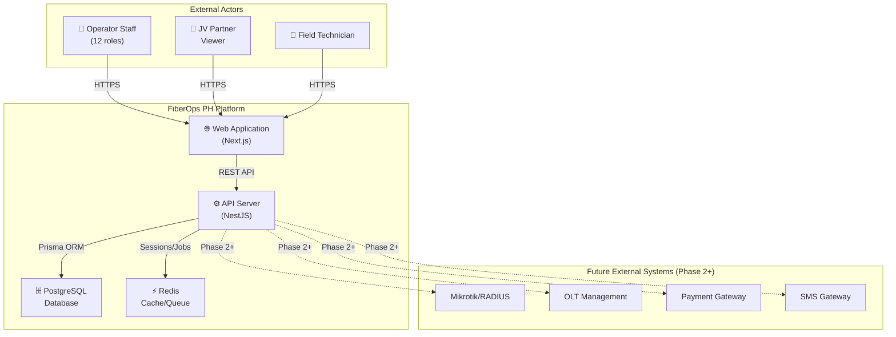
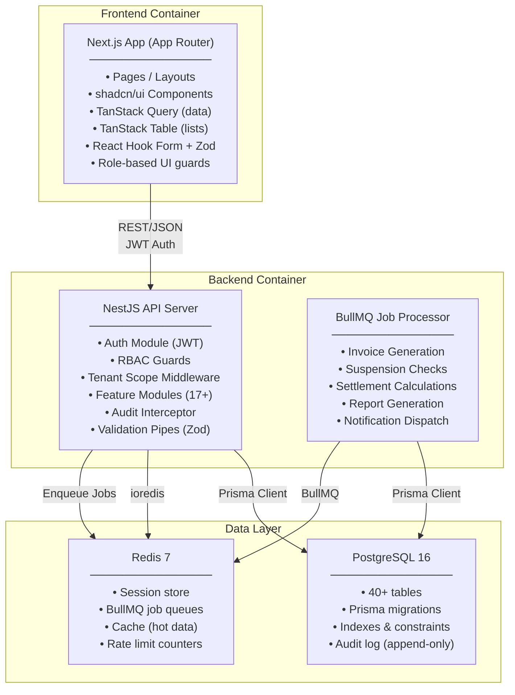
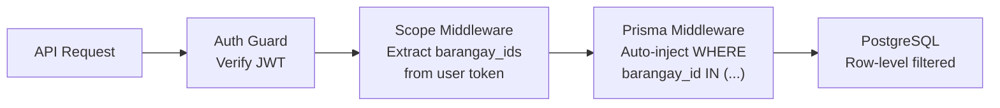

# High-Level Architecture Document (HLD)
## FiberOps PH – FTTH Barangay Multi-JV CRM / OSS-BSS Platform

**Document ID**: HLD-FOPS-001
**Version**: 1.0
**Date**: 2026-03-07

---

## 1. Architecture Vision

### Decision: Modular Monolith

FiberOps PH adopts a **modular monolith** architecture for Phase 1, with clear bounded context separation enabling future microservice extraction.

**Justification**:
- **Team size**: 2-3 developers — microservices add operational overhead disproportionate to team capacity
- **Shared database**: most queries join across domains (subscriber → billing → network) — a shared Postgres database eliminates distributed transaction complexity
- **Deployment simplicity**: single API container simplifies Docker deployment for a Philippine ISP with limited DevOps capacity
- **Module boundaries enforced by code**: NestJS module system provides import/export visibility control equivalent to service boundaries
- **Migration path**: clean module interfaces allow extracting any module into a standalone service when team scale justifies it

---

## 2. System Context Diagram (C4 Level 1)



---

## 3. Container Diagram (C4 Level 2)



---

## 4. Technology Stack Decisions

### 4.1 Backend Framework: NestJS

| Factor | NestJS | Fastify (raw) |
|--------|--------|--------------|
| Module system | ✅ First-class, enforces boundaries | ❌ Manual, no built-in module isolation |
| Dependency injection | ✅ Built-in IoC container | ❌ Requires manual wiring or awilix |
| Guards/interceptors | ✅ Declarative RBAC guards, audit interceptors | ⚠️ Plugin-based, less structured |
| Validation pipes | ✅ Built-in pipe system, Zod adapter available | ⚠️ Manual validation middleware |
| Background jobs | ✅ Official BullMQ module | ⚠️ Community integration |
| TypeScript support | ✅ Native, strict by default | ✅ Good |
| Performance | ⚠️ Slightly slower than raw Fastify | ✅ Fastest Node.js framework |
| Learning curve | ⚠️ Higher (Angular-like patterns) | ✅ Lower |

**Decision**: **NestJS** — the modular monolith architecture needs strong module boundaries, dependency injection, and declarative guards. Performance difference is negligible at our scale (<100K subscribers). NestJS can use Fastify as its HTTP adapter for performance gains.

**Configuration**: NestJS with Fastify adapter — get NestJS structure with Fastify performance.

### 4.2 ORM: Prisma

**Why Prisma**:
- Type-safe database client generated from schema
- Migration system with version control
- Middleware support for tenant scoping and audit logging
- Prisma Studio for development inspection
- Strong PostgreSQL support

**Considerations**:
- Complex aggregations may need raw SQL or Prisma's `$queryRaw`
- Settlement/billing calculations should use raw SQL for precision and performance

### 4.3 Redis Usage Patterns

| Pattern | Use Case | Configuration |
|---------|----------|--------------|
| Session store | JWT refresh token blacklist, session metadata | Key: `session:{userId}`, TTL: 7 days |
| Job queues (BullMQ) | Invoice generation, suspension checks, settlements | Named queues per domain |
| Cache | Barangay list, plan list, permission matrix | Key prefix by entity, TTL: 5-15 min |
| Rate limiting | Auth endpoints, API throttle | Sliding window, per IP + user |

### 4.4 Frontend: Next.js (App Router)

**Why Next.js**:
- Server-side rendering for initial load performance
- App Router with layout nesting matches our dashboard layout pattern
- API route handlers for BFF patterns if needed
- Built-in image optimization and code splitting
- TypeScript-first

**Client-heavy approach**: Most pages will be client-rendered (TanStack Query for data fetching) since this is an internal operational tool. SSR used only for login page and initial shell.

---

## 5. Multi-Tenancy Architecture

### Scoping Strategy: Row-Level Filtering with Middleware



**Implementation layers**:

1. **JWT Token**: Contains `userId`, `roles[]`, `barangayIds[]`, `partnerId?`
2. **Scope Guard (NestJS Guard)**: Extracts scope from token and attaches to request context
3. **Prisma Middleware**: Intercepts all `findMany`, `findFirst`, `count`, `aggregate` operations and injects `WHERE barangay_id IN (user.barangayIds)` for scoped entities
4. **Direct ID access protection**: `findUnique` by ID also verified against user scope to prevent IDOR

**Scope levels**:
- **Global**: Super Admin, Corp Admin, Auditor, Executive — see all barangays
- **Barangay-scoped**: Brgy Manager, Collection Officer, CS Support — see assigned barangays only
- **Partner-scoped**: JV Partner Viewer — see revenue/settlement data for their partner only
- **Assignment-scoped**: Field Technician — see only their assigned jobs/tickets

---

## 6. Deployment Architecture

### Local Development
```
docker-compose.yml
├── postgres:16   (port 5432)
├── redis:7       (port 6379)
├── api (NestJS)  (port 3001, hot-reload)
└── web (Next.js) (port 3000, hot-reload)
```

### Staging
- Containerized API + Web behind Nginx reverse proxy
- Managed PostgreSQL (or Docker with persistent volume)
- Redis container with persistence
- SSL via Let's Encrypt

### Production
- Same container topology, deployed to VPS or cloud
- Managed PostgreSQL (recommended: Supabase, Neon, or AWS RDS)
- Redis with persistence and backup
- Nginx with SSL termination
- Automated database backups (daily)
- Health check endpoints: `/api/health`, `/api/health/db`, `/api/health/redis`

---

## 7. Cross-Cutting Concerns

### Logging
- **Structured JSON logging** via Pino (NestJS Fastify adapter default)
- Log levels: ERROR, WARN, INFO, DEBUG
- Request logging: method, path, status, duration, userId
- Sensitive fields redacted: password, token, payment details

### Error Handling
- **Global exception filter** returns consistent error format:
  ```json
  {
    "statusCode": 400,
    "error": "VALIDATION_ERROR",
    "message": "Subscriber phone is required",
    "details": [{ "field": "phone", "constraint": "isNotEmpty" }]
  }
  ```
- Business errors use domain-specific error codes (e.g., `SETTLEMENT_ALREADY_LOCKED`)
- 500 errors logged with stack trace, returned with generic message

### Rate Limiting
- Auth endpoints: 5 requests/minute per IP
- General API: 100 requests/minute per user
- Bulk operations: 10 requests/minute per user
- Implemented via Redis sliding window

### Health Checks
- `GET /api/health` — overall health
- `GET /api/health/db` — PostgreSQL connection check
- `GET /api/health/redis` — Redis connection check
- Returns 200 OK or 503 Service Unavailable
