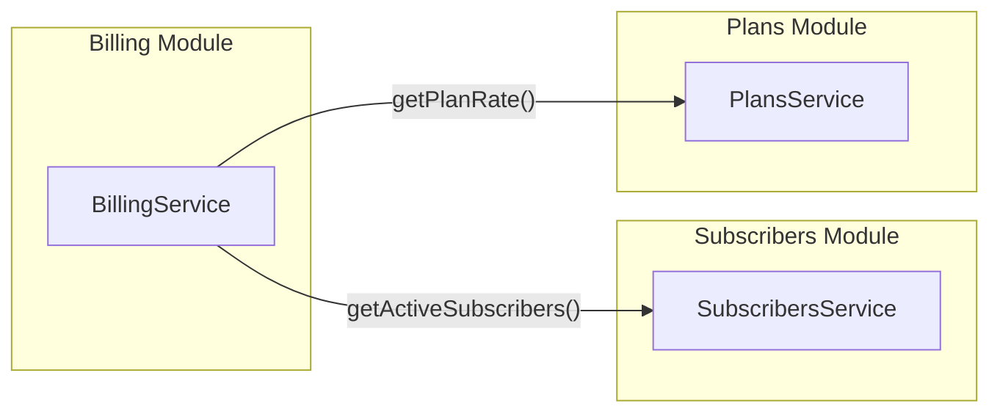
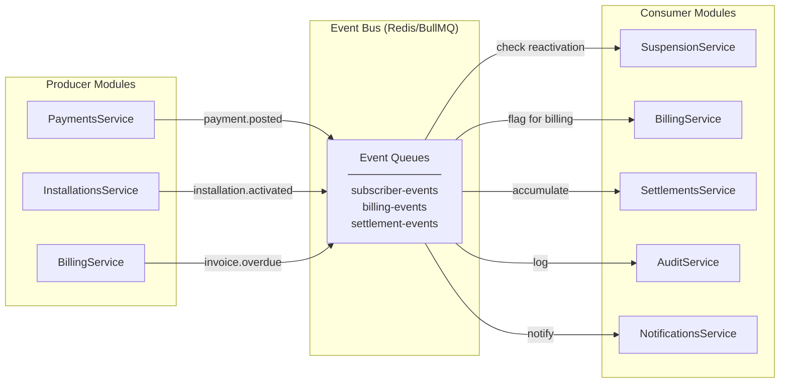

# Integration Architecture
## FiberOps PH – FTTH Barangay Multi-JV CRM / OSS-BSS Platform

**Document ID**: INT-FOPS-001
**Version**: 1.0
**Date**: 2026-03-07

---

## 1. Internal Integration Patterns

### 1.1 Synchronous: NestJS Module Imports

Modules communicate synchronously through NestJS dependency injection. A module exports its service, and consuming modules import the provider.



**Rules**:
- Only import the **service** — never the repository or controller of another module
- Circular dependencies resolved by extracting shared logic to a new module or using events
- Read operations across modules are always synchronous (direct service call)

### 1.2 Asynchronous: BullMQ Event Bus

Cross-module side effects that don't need immediate results use BullMQ queues.



---

## 2. Event Bus Design

### 2.1 Implementation: BullMQ on Redis

- **Library**: BullMQ (official NestJS integration: `@nestjs/bullmq`)
- **Broker**: Redis 7
- **Pattern**: Producer-Consumer with named queues

### 2.2 Event Naming Convention

```
{context}.{entity}.{action}
```

Examples: `subscriber.subscriber.created`, `billing.payment.posted`, `settlement.settlement.approved`

### 2.3 Event Schema Standard

Every event payload follows this interface:

```typescript
interface DomainEvent<T = unknown> {
  eventId: string;         // UUID
  eventType: string;       // e.g., "subscriber.created"
  timestamp: string;       // ISO 8601
  actorId: string;         // User who triggered the action
  tenantId: string;        // barangay_id for scoping
  entityId: string;        // ID of the affected entity
  entityType: string;      // e.g., "Subscriber"
  payload: T;              // Event-specific data
  metadata?: {
    correlationId?: string;  // For tracing across events
    causationId?: string;    // Event that caused this event
    version: number;         // Schema version
  };
}
```

### 2.4 Queue Configuration

| Queue | Concurrency | Max Retries | Backoff | Dead Letter |
|-------|:-----------:|:-----------:|---------|:-----------:|
| `subscriber-events` | 3 | 3 | Exponential (1s, 5s, 30s) | ✅ |
| `billing-events` | 1 | 5 | Exponential (2s, 10s, 60s) | ✅ |
| `settlement-events` | 1 | 3 | Exponential (5s, 30s, 120s) | ✅ |
| `audit-events` | 5 | 10 | Fixed (1s) | ✅ |
| `notification-events` | 5 | 3 | Exponential (1s, 5s, 30s) | ✅ |

### 2.5 Dead Letter Handling

Failed events after max retries move to `{queue}:dead` queue:
- Admin UI shows dead letter queue contents
- Events can be manually retried or dismissed
- Financial events (billing, settlement) generate alerts for Finance role

### 2.6 Idempotency

All event consumers must be idempotent. Approach:
- Each event has a unique `eventId`
- Consumer checks `processed_events` table before processing
- If `eventId` already exists, skip processing (return success)

---

## 3. External Integration Points (Phase 2 Readiness)

### 3.1 Mikrotik / RADIUS API

| Attribute | Value |
|-----------|-------|
| **Purpose** | Subscriber bandwidth management, hotspot auth |
| **Protocol** | REST API (Mikrotik RouterOS API) |
| **Integration Type** | Outbound from FiberOps API |
| **Phase** | Phase 2+ |
| **Readiness** | Define `NetworkProvisioningService` interface in Phase 1; implement in Phase 2 |

**Abstraction**:
```typescript
interface NetworkProvisioningService {
  provisionSubscriber(subscriberId: string, planId: string): Promise<void>;
  suspendSubscriber(subscriberId: string): Promise<void>;
  reactivateSubscriber(subscriberId: string): Promise<void>;
  updateBandwidth(subscriberId: string, speedMbps: number): Promise<void>;
}
```
Phase 1: `NoopNetworkProvisioningService` (logs and returns success)
Phase 2: `MikrotikNetworkProvisioningService` (actual API calls)

### 3.2 OLT Management API

| Attribute | Value |
|-----------|-------|
| **Purpose** | ONT provisioning, PON port monitoring |
| **Protocol** | SNMP or vendor REST API |
| **Phase** | Phase 2+ |
| **Readiness** | `OltManagementService` stub interface |

### 3.3 Payment Gateway

| Attribute | Value |
|-----------|-------|
| **Purpose** | Online payment processing (GCash, bank transfer) |
| **Protocol** | REST API (PayMongo, Dragonpay, or similar) |
| **Phase** | Phase 2+ |
| **Readiness** | `PaymentGatewayService` interface with webhook handler |

**Abstraction**:
```typescript
interface PaymentGatewayService {
  createPaymentIntent(amount: number, subscriberId: string): Promise<PaymentIntent>;
  verifyPayment(paymentIntentId: string): Promise<PaymentVerification>;
  handleWebhook(payload: unknown): Promise<void>;
}
```

### 3.4 SMS Gateway

| Attribute | Value |
|-----------|-------|
| **Purpose** | Subscriber notifications (billing reminders, outage alerts) |
| **Protocol** | REST API (Semaphore, Globe Labs, or similar PH SMS provider) |
| **Phase** | Phase 2+ |
| **Readiness** | `SmsService` interface in Notifications module |

### 3.5 Accounting System

| Attribute | Value |
|-----------|-------|
| **Purpose** | Export financial data to QuickBooks, Xero, or local accounting |
| **Protocol** | REST API or CSV export |
| **Phase** | Phase 2+ |
| **Readiness** | `AccountingExportService` interface |

---

## 4. Integration Contracts Summary

| Integration | Direction | Auth | Data Format | Error Strategy | Fallback |
|------------|-----------|------|-------------|---------------|----------|
| Mikrotik/RADIUS | Outbound | API Key | JSON | Retry 3x, then queue for manual | Log and continue; manual provisioning |
| OLT Management | Outbound | SNMP community / API key | JSON/SNMP | Retry 3x | Log warning; no automated fallback |
| Payment Gateway | Inbound+Outbound | API Key + Webhook Secret | JSON | Verify webhook signature; retry outbound 3x | Manual payment posting via collection officer |
| SMS Gateway | Outbound | API Key | JSON | Retry 3x, then dead letter | In-app notification fallback |
| Accounting | Outbound | API Key or file export | JSON/CSV | Retry 3x | Manual export download |

> **Critical design principle**: All external integrations must have graceful degradation. FiberOps PH must remain fully operational if any external system is unavailable.
