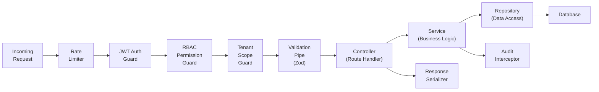
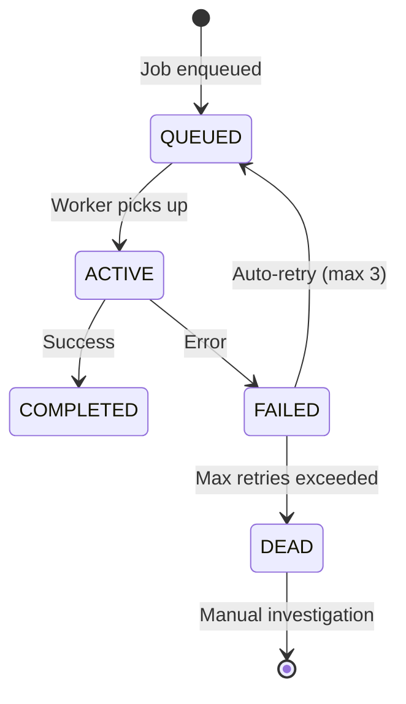

# Technical Solution Design (TSD)
## FiberOps PH – FTTH Barangay Multi-JV CRM / OSS-BSS Platform

**Document ID**: TSD-FOPS-001
**Version**: 1.0
**Date**: 2026-03-07

---

## 1. Backend Module Decomposition

Each module follows the NestJS module pattern with strict import/export boundaries.

| Module | Responsibilities | Exports (Public API) |
|--------|-----------------|---------------------|
| `auth` | Login, JWT, refresh, password reset, rate limiting | `AuthService`, `JwtGuard` |
| `users` | User CRUD, profile management | `UsersService` |
| `rbac` | Roles, permissions, guards, scope checking | `RbacGuard`, `ScopeGuard`, `PermissionsService` |
| `barangays` | Barangay CRUD, service zones | `BarangaysService` |
| `partners` | JV partner entity management | `PartnersService` |
| `agreements` | JV agreements, revenue share templates | `AgreementsService` |
| `plans` | Service plans, pricing, promos | `PlansService` |
| `subscribers` | Subscriber lifecycle, search, profile | `SubscribersService` |
| `network-assets` | FTTH hierarchy, asset CRUD, topology | `NetworkAssetsService` |
| `installations` | Job orders, workflow, technician assignment | `InstallationsService` |
| `tickets` | Trouble tickets, SLA, dispatch, resolution | `TicketsService` |
| `billing` | Cycles, invoice generation, prorating, penalties | `BillingService` |
| `payments` | Payment posting, ledger, receipt tracking | `PaymentsService` |
| `suspension` | Grace periods, suspend/reactivate, rule engine | `SuspensionService` |
| `settlements` | Revenue calculation, approval, statements | `SettlementsService` |
| `dashboards` | Aggregate queries, widget data | `DashboardsService` |
| `reports` | Report generation, export, KPIs | `ReportsService` |
| `audit` | Audit log writing, querying, retention | `AuditService`, `AuditInterceptor` |
| `notifications` | In-app notification engine | `NotificationsService` |
| `settings` | System configuration, master data | `SettingsService` |
| `common` | Shared middleware, pipes, filters, decorators | All shared utilities |

---

## 2. Module Communication Patterns

### Direct Service Injection (Synchronous)
Used when the caller needs an immediate result:

```
SubscribersService → PlansService.findById(planId)  // Get plan details
BillingService → SubscribersService.findActive(barangayId)  // Get billable subscribers
SettlementsService → PaymentsService.getCollections(period)  // Get payment totals
```

### Event-Driven (Asynchronous via BullMQ)
Used when the action triggers downstream processes:

```
subscriber.activated → BillingService: flag for next billing cycle
payment.posted → SuspensionService: check if reactivation needed
invoice.overdue → SuspensionService: check if suspension needed
settlement.approved → NotificationsService: notify partner
```

**Rule of thumb**: If the downstream action can fail independently without rolling back the upstream action, use events. If the downstream result is needed to complete the upstream operation, use direct calls.

---

## 3. Service Layer Design

### Pattern: Controller → Service → Repository → Prisma

```
┌────────────────────────────────────────────────────────┐
│  Controller (Route Handler)                             │
│  - Parse request params/body                            │
│  - Call service method                                  │
│  - Return response                                      │
│  - NO business logic                                    │
└──────────────────────┬─────────────────────────────────┘
                       │
┌──────────────────────▼─────────────────────────────────┐
│  Service (Business Logic)                               │
│  - Validation beyond schema (business rules)            │
│  - Orchestrate repository calls                         │
│  - Emit domain events                                   │
│  - Handle transactions                                  │
│  - Business error handling                              │
└──────────────────────┬─────────────────────────────────┘
                       │
┌──────────────────────▼─────────────────────────────────┐
│  Repository (Data Access)                               │
│  - Prisma queries (find, create, update, delete)        │
│  - Scope-aware queries (barangay filtering)             │
│  - Pagination, sorting, filtering                       │
│  - Raw SQL for complex aggregations                     │
└──────────────────────┬─────────────────────────────────┘
                       │
┌──────────────────────▼─────────────────────────────────┐
│  Prisma Client + Middleware                             │
│  - Auto tenant scoping                                  │
│  - Soft delete filtering                                │
│  - Audit log writing                                    │
└────────────────────────────────────────────────────────┘
```

---

## 4. API Design Standards

### RESTful Conventions

| Operation | Method | Path Pattern | Example |
|-----------|--------|-------------|---------|
| List (paginated) | GET | `/api/{resource}` | `GET /api/subscribers?page=1&limit=20` |
| Get by ID | GET | `/api/{resource}/:id` | `GET /api/subscribers/uuid-123` |
| Create | POST | `/api/{resource}` | `POST /api/subscribers` |
| Update | PATCH | `/api/{resource}/:id` | `PATCH /api/subscribers/uuid-123` |
| Delete (soft) | DELETE | `/api/{resource}/:id` | `DELETE /api/subscribers/uuid-123` |
| Status change | PATCH | `/api/{resource}/:id/status` | `PATCH /api/subscribers/uuid-123/status` |
| Sub-resource | GET | `/api/{resource}/:id/{sub}` | `GET /api/subscribers/uuid-123/billing` |
| Action | POST | `/api/{resource}/:id/{action}` | `POST /api/settlements/uuid-123/approve` |

### Pagination Response

```json
{
  "data": [...],
  "meta": {
    "total": 1250,
    "page": 1,
    "limit": 20,
    "totalPages": 63,
    "hasNext": true,
    "hasPrevious": false
  }
}
```

### Filtering & Sorting

```
GET /api/subscribers?barangay_id=uuid&status=ACTIVE&sort=-created_at&search=Juan
```

- Filters: query params matching field names
- Sort: `sort=field` (asc), `sort=-field` (desc)
- Search: `search=term` (full-text across configured fields)

### Error Response Format

```json
{
  "statusCode": 422,
  "error": "BUSINESS_RULE_VIOLATION",
  "message": "Cannot suspend subscriber with active dispute",
  "code": "SUBSCRIBER_HAS_ACTIVE_DISPUTE",
  "details": {
    "subscriberId": "uuid-123",
    "disputeId": "uuid-456"
  }
}
```

---

## 5. Request/Response Pipeline



**Pipeline order**:
1. **Rate Limiter** — Redis-based sliding window
2. **JWT Auth Guard** — Verify token, extract user context
3. **RBAC Permission Guard** — Check `@RequirePermission('subscribers.subscriber.create')`
4. **Tenant Scope Guard** — Attach `barangayIds[]` to request context
5. **Validation Pipe** — Zod schema validation of body/params/query
6. **Controller** — Thin handler, delegates to service
7. **Service** — Business logic, emits events
8. **Audit Interceptor** — After response, log mutation details

---

## 6. Job/Queue Architecture

### BullMQ Queue Design

| Queue Name | Purpose | Schedule | Concurrency |
|-----------|---------|----------|:-----------:|
| `billing:generate-invoices` | Monthly invoice batch generation | Cron: 1st of month | 1 |
| `billing:apply-penalties` | Apply late penalties to overdue invoices | Cron: daily | 1 |
| `suspension:check-overdue` | Evaluate accounts for suspension | Cron: daily | 1 |
| `suspension:reactivate` | Check posted payments for reactivation | Event-triggered | 3 |
| `settlements:calculate` | Monthly settlement calculation | Cron: 5th of month | 1 |
| `reports:generate` | On-demand report generation | Event-triggered | 2 |
| `notifications:dispatch` | Send in-app notifications | Event-triggered | 5 |
| `audit:batch-write` | Batch audit log writes for performance | Interval: 5 sec | 1 |

### Job Lifecycle



### Retry Policy
- Max retries: 3
- Backoff: exponential (1s, 5s, 30s)
- Dead letter queue for manual investigation
- Financial jobs (billing, settlement) require success notification to Finance role

---

## 7. Caching Strategy

| Data | Cache Key | TTL | Invalidation |
|------|----------|:---:|-------------|
| Barangay list | `cache:barangays` | 15 min | On barangay create/update |
| Service plans | `cache:plans` | 15 min | On plan create/update |
| Permission matrix | `cache:permissions:{roleId}` | 10 min | On role/permission change |
| User scope | `cache:scope:{userId}` | 5 min | On scope assignment change |
| Dashboard aggregates | `cache:dashboard:{type}:{barangayId}` | 2 min | TTL-only (frequent refresh) |

**Cache busting**: On mutation of cached entity, delete relevant cache key(s). Dashboard caches use TTL-only (no active invalidation) since real-time accuracy is not critical for dashboards.

---

## 8. File/Blob Handling

### Phase 1: Local File Storage
- Upload to `./uploads/{entity}/{entityId}/{filename}`
- Serve via static file route `/api/files/:path`
- Metadata stored in `attachments` table

### Phase 2: Object Storage Abstraction
- Interface: `FileStorageService` with `upload()`, `download()`, `delete()`
- Phase 1 implementation: local filesystem
- Phase 2 implementation: S3-compatible (MinIO, AWS S3, or Cloudflare R2)
- Zero code changes needed in consumers

### File Types Supported
- Installation photos (JPEG/PNG, max 5MB)
- Partner statements (PDF, generated)
- Report exports (CSV, XLSX)
- Subscriber KYC documents (JPEG/PNG/PDF, max 10MB)
