# Data Model / Entity Relationship Diagram (ERD)
## FiberOps PH – FTTH Barangay Multi-JV CRM / OSS-BSS Platform

**Document ID**: ERD-FOPS-001
**Version**: 1.0
**Date**: 2026-03-07

---

## 1. Entity Relationship Diagram

```mermaid
erDiagram
    %% Identity & Access
    users ||--o{ user_roles : "has"
    users ||--o{ user_scopes : "scoped to"
    users ||--o{ sessions : "maintains"
    roles ||--o{ user_roles : "assigned via"
    roles ||--o{ role_permissions : "grants"
    permissions ||--o{ role_permissions : "included in"

    %% Tenant Management
    barangays ||--o{ service_zones : "contains"
    barangays ||--o{ subscribers : "hosts"
    barangays ||--o{ network_assets : "located in"
    barangays ||--o{ billing_cycles : "runs"
    partners ||--o{ partner_agreements : "party to"
    barangays ||--o{ partner_agreements : "covered by"
    partner_agreements ||--o{ revenue_share_rules : "defines"
    partner_agreements ||--o{ settlements : "settles"

    %% Subscriber
    subscribers ||--o| subscriber_addresses : "lives at"
    subscribers ||--o{ subscriptions : "subscribes"
    subscribers ||--o{ installation_jobs : "requests"
    subscribers ||--o{ service_tickets : "raises"
    subscribers ||--o{ invoices : "billed"
    subscribers ||--o{ payments : "pays"
    subscribers ||--o{ account_ledger_entries : "ledger"
    subscribers ||--o{ suspension_actions : "subject to"

    %% Product & Pricing
    service_plans ||--o{ plan_features : "includes"
    service_plans ||--o{ subscriptions : "used by"
    service_plans ||--o{ promos : "discounted by"

    %% Network
    network_asset_types ||--o{ network_assets : "classifies"
    network_assets ||--o{ network_assets : "parent-child"
    network_assets ||--o| olt_ports : "detail"
    network_assets ||--o| splitters : "detail"
    network_assets ||--o| distribution_boxes : "detail"
    network_assets ||--o| ont_devices : "detail"
    network_assets ||--o{ fiber_segments : "connects from"
    ont_devices ||--o| subscribers : "assigned to"

    %% Installation
    installation_jobs ||--o{ installation_materials : "uses"
    installation_jobs ||--o{ installation_photos : "documents"
    users ||--o{ installation_jobs : "assigned as tech"

    %% Tickets
    service_tickets ||--o{ ticket_assignments : "assigned"
    service_tickets ||--o{ ticket_notes : "noted"
    service_tickets ||--o{ ticket_field_visits : "visited"

    %% Billing
    billing_cycles ||--o{ invoices : "generates"
    invoices ||--o{ invoice_lines : "itemizes"
    invoices ||--o{ payments : "paid by"
    invoices ||--o{ adjustments : "adjusted"
    invoices ||--o{ write_offs : "written off"

    %% Settlement
    settlements ||--o{ settlement_lines : "itemizes"
    settlements ||--o{ settlement_adjustments : "adjusted"
    settlements ||--o| partner_statements : "produces"

    %% System
    audit_logs }o--|| users : "performed by"
```

---

## 2. Entity Groups by Domain

### 2.1 Identity & Access (7 tables)

| Entity | Purpose | Key Relationships |
|--------|---------|-------------------|
| `users` | System user accounts | → roles (via user_roles), → barangays (via user_scopes) |
| `roles` | Named permission groups | → permissions (via role_permissions) |
| `permissions` | Granular access rights | → roles (via role_permissions) |
| `user_roles` | Junction: user ↔ role | users.id, roles.id |
| `user_scopes` | Junction: user ↔ barangay/partner | users.id, barangays.id, partners.id |
| `role_permissions` | Junction: role ↔ permission | roles.id, permissions.id |
| `sessions` | Active login sessions | → users |

### 2.2 Tenant Management (5 tables)

| Entity | Purpose | Key Relationships |
|--------|---------|-------------------|
| `barangays` | Service area unit | parent of subscribers, assets, billing_cycles |
| `service_zones` | Sub-division of barangay | → barangays |
| `partners` | JV partner company | → partner_agreements |
| `partner_agreements` | Contract terms | → partners, → barangays, → revenue_share_rules |
| `revenue_share_rules` | Calculation parameters | → partner_agreements |

### 2.3 Subscriber (3 tables)

| Entity | Purpose | Key Relationships |
|--------|---------|-------------------|
| `subscribers` | Customer account | → barangays, → subscriptions, → invoices, → tickets |
| `subscriber_addresses` | Service location with geotag | → subscribers (1:1) |
| `subscriptions` | Plan assignment per subscriber | → subscribers, → service_plans |

### 2.4 Product & Pricing (3 tables)

| Entity | Purpose | Key Relationships |
|--------|---------|-------------------|
| `service_plans` | Internet service tiers | → subscriptions, → plan_features |
| `plan_features` | Additional plan attributes | → service_plans |
| `promos` | Promotional discounts | → service_plans |

### 2.5 Network Inventory (7 tables)

| Entity | Purpose | Key Relationships |
|--------|---------|-------------------|
| `network_assets` | Generic asset with hierarchy | → network_asset_types, self-ref parent, → barangays |
| `network_asset_types` | Asset classification | parent of network_assets |
| `olt_ports` | OLT port details | → network_assets (1:1) |
| `splitters` | Splitter details | → network_assets (1:1) |
| `distribution_boxes` | Distribution point | → network_assets (1:1) |
| `ont_devices` | CPE device | → network_assets (1:1), → subscribers |
| `fiber_segments` | Cable between assets | → network_assets (from/to) |

### 2.6 Installation (3 tables)

| Entity | Purpose | Key Relationships |
|--------|---------|-------------------|
| `installation_jobs` | Work order | → subscribers, → users (technician) |
| `installation_materials` | Materials used | → installation_jobs |
| `installation_photos` | Verification photos | → installation_jobs |

### 2.7 Service Desk (4 tables)

| Entity | Purpose | Key Relationships |
|--------|---------|-------------------|
| `service_tickets` | Trouble/service request | → subscribers, → network_assets |
| `ticket_assignments` | Technician assignment | → service_tickets, → users |
| `ticket_notes` | Status updates | → service_tickets, → users |
| `ticket_field_visits` | On-site visit records | → service_tickets, → users |

### 2.8 Billing & Collections (6 tables)

| Entity | Purpose | Key Relationships |
|--------|---------|-------------------|
| `billing_cycles` | Monthly billing period | → barangays, → invoices |
| `invoices` | Subscriber bill | → subscribers, → billing_cycles |
| `invoice_lines` | Line item detail | → invoices |
| `payments` | Received payment | → invoices, → subscribers |
| `adjustments` | Credit/debit | → invoices |
| `write_offs` | Bad debt | → invoices |

### 2.9 Account Ledger (1 table)

| Entity | Purpose | Key Relationships |
|--------|---------|-------------------|
| `account_ledger_entries` | Running balance | → subscribers |

### 2.10 Suspension (1 table)

| Entity | Purpose | Key Relationships |
|--------|---------|-------------------|
| `suspension_actions` | Suspend/reactivate records | → subscribers |

### 2.11 Settlement (4 tables)

| Entity | Purpose | Key Relationships |
|--------|---------|-------------------|
| `settlements` | Period settlement | → partner_agreements |
| `settlement_lines` | Detail lines | → settlements |
| `settlement_adjustments` | Manual corrections | → settlements |
| `partner_statements` | Generated statement | → settlements (1:1) |

### 2.12 System (3 tables)

| Entity | Purpose | Key Relationships |
|--------|---------|-------------------|
| `audit_logs` | Immutable mutation record | → users (actor) |
| `attachments` | File metadata | polymorphic (entity_type + entity_id) |
| `system_settings` | Key-value configuration | standalone |

---

## 3. Total Entity Count

| Domain | Tables |
|--------|:------:|
| Identity & Access | 7 |
| Tenant Management | 5 |
| Subscriber | 3 |
| Product & Pricing | 3 |
| Network Inventory | 7 |
| Installation | 3 |
| Service Desk | 4 |
| Billing & Collections | 6 |
| Account Ledger | 1 |
| Suspension | 1 |
| Settlement | 4 |
| System | 3 |
| **Total** | **47** |

---

## 4. Critical Indexes

| Table | Index | Purpose |
|-------|-------|---------|
| `subscribers` | `(barangay_id, status)` | Scoped subscriber listing |
| `subscribers` | `(account_number)` UNIQUE | Account number lookup |
| `invoices` | `(subscriber_id, status)` | Outstanding invoice queries |
| `invoices` | `(billing_cycle_id)` | Cycle-based retrieval |
| `payments` | `(subscriber_id, posted_at)` | Payment history |
| `account_ledger_entries` | `(subscriber_id, created_at)` | Ledger balance queries |
| `service_tickets` | `(subscriber_id, status)` | Active ticket lookup |
| `service_tickets` | `(barangay_id, status, priority)` | Dispatch board queries |
| `network_assets` | `(barangay_id, asset_type_id, status)` | Asset listing |
| `network_assets` | `(parent_asset_id)` | Hierarchy traversal |
| `settlements` | `(agreement_id, period_start)` UNIQUE | Period uniqueness |
| `audit_logs` | `(entity_type, entity_id, created_at)` | Entity audit trail |
| `audit_logs` | `(actor_id, created_at)` | Actor audit trail |
