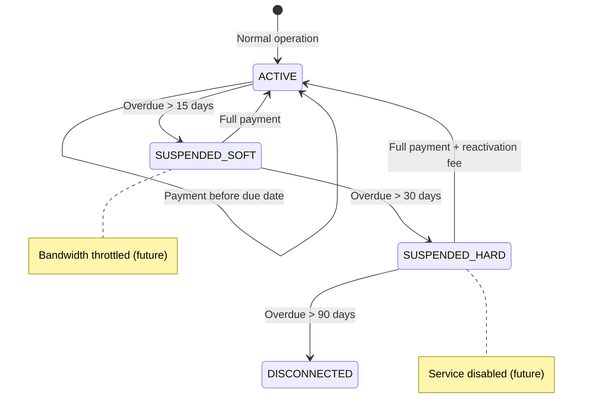

# Business Rule Engines
## FiberOps PH – Revenue Sharing, Billing, and Suspension Rules

**Document ID**: RUL-FOPS-001
**Version**: 1.0
**Date**: 2026-03-07

---

## 1. Revenue Sharing Rule Engine

### 1.1 Overview

The Revenue Sharing Rule Engine calculates JV partner payables for each settlement period based on the terms configured in the `PartnerAgreement` and its associated `RevenueShareRules`.

### 1.2 Calculation Models

#### Model A: Gross Revenue Basis

```
Partner Share = Gross Collections × Partner Percentage

Where:
  Gross Collections = SUM(payments.amount) 
    WHERE payments.barangay_id = agreement.barangay_id
    AND payments.posted_at BETWEEN period_start AND period_end
    AND payments.reversed_at IS NULL
```

**Example**:
- Brgy. Poblacion collected ₱500,000 in March 2026
- Partner agreement: 30% gross revenue share
- Partner share = ₱500,000 × 0.30 = **₱150,000**
- Operator share = ₱500,000 × 0.70 = **₱350,000**

#### Model B: Net Revenue Basis

```
Net Revenue = Gross Collections − Allowed Deductions
Partner Share = Net Revenue × Partner Percentage

Where:
  Allowed Deductions = SUM of configured deduction buckets
  Each bucket = Gross Collections × bucket_percentage
```

**Example**:
- Gross Collections: ₱500,000
- Deduction buckets:
  - OpEx maintenance: 5% = ₱25,000
  - Admin overhead: 3% = ₱15,000
  - Marketing fund: 2% = ₱10,000
  - **Total deductions**: ₱50,000
- Net Revenue: ₱500,000 − ₱50,000 = ₱450,000
- Partner percentage: 30%
- Partner share = ₱450,000 × 0.30 = **₱135,000**
- Operator share = ₱450,000 × 0.70 = **₱315,000**

### 1.3 Deduction Buckets Schema

```json
{
  "deduction_buckets": [
    { "name": "opex_maintenance", "label": "OpEx Maintenance", "percentage": 5.00 },
    { "name": "admin_overhead", "label": "Admin Overhead", "percentage": 3.00 },
    { "name": "marketing_fund", "label": "Marketing Fund", "percentage": 2.00 }
  ]
}
```

### 1.4 Calculation Rules

| Rule ID | Rule | Implementation |
|---------|------|---------------|
| REV-001 | Only non-reversed payments count toward gross collections | `WHERE reversed_at IS NULL` filter |
| REV-002 | Payment posting date determines period, not invoice date | `payments.posted_at BETWEEN period_start AND period_end` |
| REV-003 | All monetary calculations use DECIMAL(18,2) | Prisma `@db.Decimal(18,2)` |
| REV-004 | Rounding: round to 2 decimal places at final result only | Apply `ROUND(value, 2)` at partner_share calculation |
| REV-005 | Overpayments (credits) excluded from revenue calculation | Only positive payment amounts counted |
| REV-006 | Settlement is idempotent | Re-running for same period produces identical result |
| REV-007 | Locked periods cannot be recalculated | Check `settlement.locked_at IS NOT NULL` before any mutation |
| REV-008 | Manual adjustments modify the settlement total, not the formula | `settlement_adjustments` table used for post-calculation adjustments |
| REV-009 | Agreement version at period_end governs calculation | Use agreement version active at period_end date |

### 1.5 Settlement Line Generation

Each settlement generates detailed line items for auditability:

| Line Type | Description | Amount Source |
|-----------|-------------|-------------|
| `GROSS_COLLECTION` | Total payments collected | SUM(payments.amount) |
| `DEDUCTION_OPEX` | Operating expense deduction | Gross × bucket_pct |
| `DEDUCTION_ADMIN` | Admin overhead deduction | Gross × bucket_pct |
| `DEDUCTION_MARKETING` | Marketing fund deduction | Gross × bucket_pct |
| `NET_REVENUE` | After deductions | Gross − total deductions |
| `PARTNER_SHARE` | Partner's computed share | Net × partner_pct |
| `OPERATOR_SHARE` | Operator's computed share | Net − partner_share |
| `ADJUSTMENT` | Manual post-calculation adjustment | Manual amount |
| `FINAL_PARTNER_PAYABLE` | Net amount due to partner | Partner_share ± adjustments |

### 1.6 Validation Rules

| Test Case | Expected | Priority |
|-----------|----------|:--------:|
| partner_share + operator_share = net_revenue | Always true (to the centavo) | Critical |
| Sum of deduction line items = total_deductions | Always true | Critical |
| gross_revenue - total_deductions = net_revenue | Always true | Critical |
| Re-calculation of same period = same result | Idempotent | Critical |
| Locked settlement rejects mutation | Error returned | Critical |

---

## 2. Billing Rule Engine

### 2.1 Monthly Invoice Generation

**Trigger**: Scheduled job (1st of each month) or manual trigger by Finance.

```
For each active billing cycle:
  For each subscriber WHERE:
    - subscriber.barangay_id = cycle.barangay_id
    - subscriber.status IN (ACTIVE, SUSPENDED_SOFT, SUSPENDED_HARD)
    - subscriber has an active subscription
  
  Generate invoice with:
    - Monthly charge line: subscription.plan.monthly_fee
    - Promo discount line (if applicable): -discount_amount or -(monthly_fee × discount_pct)
    - Prorate line (if mid-cycle activation): calculated prorate amount
    - Pending penalties from previous overdue invoices
```

### 2.2 Proration Rules

| Scenario | Formula | Example |
|----------|---------|---------|
| **Mid-cycle activation** | `monthly_fee × (remaining_days / total_days_in_month)` | Activated March 15, 31-day month: ₱1,500 × (17/31) = ₱822.58 |
| **Mid-cycle plan upgrade** | Credit: `-old_rate × (remaining_days / total_days)`; Charge: `+new_rate × (remaining_days / total_days)` | Upgrade March 15: -₱1,500×(17/31) + ₱2,500×(17/31) = net ₱548.39 charge |
| **Mid-cycle plan downgrade** | Same formula as upgrade (credit + charge) | Credit exceeds charge → net credit on next invoice |
| **Mid-cycle disconnect** | Credit: `-monthly_fee × (remaining_days / total_days)` applied to next invoice or refund | — |

### 2.3 Penalty Calculation

```
Penalty Rules (configurable via system_settings):
  - Grace period: 15 days after due date (no penalty)
  - After grace period: penalty = configurable amount (default ₱50) or percentage
  - Penalty applies once per invoice (not compounding)
  - Penalty capped at configurable max (default 10% of invoice total)
```

| Setting Key | Default | Description |
|------------|---------|-------------|
| `billing.grace_period_days` | 15 | Days after due date before penalty |
| `billing.penalty_type` | `FIXED` | FIXED or PERCENTAGE |
| `billing.penalty_fixed_amount` | 50.00 | Fixed penalty amount in PHP |
| `billing.penalty_percentage` | 5.00 | Percentage of invoice total |
| `billing.penalty_cap_percentage` | 10.00 | Max penalty as % of invoice |

### 2.4 Payment Application Rules (FIFO)

```
When payment.posted:
  1. Get subscriber's open invoices ORDER BY due_date ASC (oldest first)
  2. For each invoice:
     a. remaining = invoice.total_amount - invoice.amount_paid
     b. IF payment_amount >= remaining:
        - Apply remaining to invoice → mark PAID
        - payment_amount -= remaining
     c. ELSE:
        - Apply payment_amount to invoice → mark PARTIALLY_PAID
        - payment_amount = 0
  3. IF payment_amount > 0 after all invoices:
     - Create CREDIT ledger entry (overpayment)
  4. Update account_ledger_entries with PAYMENT entry
```

### 2.5 Invoice Line Types

| Line Type | When Generated |
|-----------|---------------|
| MONTHLY_CHARGE | Every billing cycle for active subscription |
| INSTALLATION_FEE | First invoice only, if plan has install fee |
| PENALTY | When overdue invoice + grace period exceeded |
| DISCOUNT | Applied from promo or manual discount |
| PROMO_DISCOUNT | Time-limited promo discount |
| PRORATE_CHARGE | Mid-cycle activation or upgrade |
| PRORATE_CREDIT | Mid-cycle downgrade or disconnect |
| ADJUSTMENT | Manual credit/debit by finance |
| REACTIVATION_FEE | On reactivation from suspension |

### 2.6 Billing Validation Rules

| Rule | Validation | Priority |
|------|-----------|:--------:|
| Invoice total = sum of line items | `total_amount = SUM(invoice_lines.amount)` | Critical |
| amount_paid ≤ total_amount | No overpayment applied to single invoice | Critical |
| Monthly fee from plan, not hardcoded | Invoice references active plan rate | Critical |
| Prorate uses actual calendar days | Not 30-day assumption | High |
| Penalty applies only once per invoice | Check if penalty line already exists | High |

---

## 3. Suspension Rule Engine

### 3.1 Suspension Thresholds

```
Daily Cron Job (suspension:check-overdue):
  For each subscriber.status = ACTIVE:
    Check oldest unpaid invoice
    days_overdue = today - invoice.due_date

    IF days_overdue > soft_suspension_threshold:
      → Execute SOFT suspension
      → Log suspension_action
      → Emit subscriber.suspended event (type: SOFT)

  For each subscriber.status = SUSPENDED_SOFT:
    IF days_overdue > hard_suspension_threshold:
      → Execute HARD suspension
      → Log suspension_action
      → Emit subscriber.suspended event (type: HARD)
```

| Setting Key | Default | Description |
|------------|---------|-------------|
| `suspension.soft_threshold_days` | 15 | Days overdue → soft suspend |
| `suspension.hard_threshold_days` | 30 | Days overdue → hard suspend |
| `suspension.auto_disconnect_days` | 90 | Days overdue → auto disconnect |
| `suspension.reactivation_fee_enabled` | true | Charge fee on reactivation |
| `suspension.reactivation_fee_amount` | 200.00 | Reactivation fee in PHP |

### 3.2 Suspension States



### 3.3 Reactivation Rules

```
When payment.posted for suspended subscriber:
  1. Calculate total outstanding = SUM(unpaid invoices)
  2. IF subscriber.status = SUSPENDED_SOFT:
     a. IF payment covers all outstanding invoices:
        → Auto-reactivate to ACTIVE
        → Log suspension_action (REACTIVATED)
  3. IF subscriber.status = SUSPENDED_HARD:
     a. IF payment covers all outstanding + reactivation fee:
        → Auto-reactivate to ACTIVE
        → Add reactivation fee as invoice line on next invoice
        → Log suspension_action (REACTIVATED)
     b. IF payment covers outstanding but NOT reactivation fee:
        → Remain SUSPENDED_HARD (partial payment applied to invoices)
  4. Manual override:
     → Authorized role (Finance, Corp Admin) can reactivate without full payment
     → Logs MANUAL_OVERRIDE suspension_action with mandatory reason
```

### 3.4 Exemption Rules

| Condition | Effect |
|-----------|--------|
| Subscriber has active dispute ticket | Skip suspension check |
| Subscriber flagged as VIP | Skip auto-suspension; manual only |
| Payment arrangement recorded | Extend threshold by arrangement days |
| Account credit balance ≥ outstanding | Auto-apply credit; skip suspension |

### 3.5 Suspension Validation Rules

| Rule | Validation | Priority |
|------|-----------|:--------:|
| Only active subscribers can be soft-suspended | `status = ACTIVE` check | Critical |
| Only soft-suspended can be hard-suspended | `status = SUSPENDED_SOFT` check | Critical |
| Reactivation requires full payment (unless manual override) | Payment ≥ outstanding check | Critical |
| Manual override requires authorized role | RBAC check: Finance or Corp Admin | Critical |
| All suspension actions are audit-logged | `suspension_actions` record created | Critical |
| Dispute exemption prevents auto-suspension | Active ticket with category BILLING_ISSUE | High |

---

## 4. Account Ledger Rules

### 4.1 Ledger Entry Generation

Every financial event creates a ledger entry for the subscriber's running balance:

| Event | Entry Type | Debit/Credit | Amount |
|-------|-----------|:------------:|--------|
| Invoice generated | CHARGE | Debit (+) | Invoice total |
| Payment posted | PAYMENT | Credit (−) | Payment amount |
| Late penalty | PENALTY | Debit (+) | Penalty amount |
| Credit adjustment | ADJUSTMENT_CREDIT | Credit (−) | Adjustment amount |
| Debit adjustment | ADJUSTMENT_DEBIT | Debit (+) | Adjustment amount |
| Write-off | WRITE_OFF | Credit (−) | Written off amount |
| Payment reversal | REVERSAL | Debit (+) | Reversed amount |
| Reactivation fee | REACTIVATION_FEE | Debit (+) | Fee amount |

### 4.2 Balance Calculation

```
Current Balance = SUM of all ledger entries for subscriber
  Debits (CHARGE, PENALTY, ADJUSTMENT_DEBIT, REVERSAL, REACTIVATION_FEE) → positive
  Credits (PAYMENT, ADJUSTMENT_CREDIT, WRITE_OFF) → negative

If balance > 0 → subscriber owes money
If balance < 0 → subscriber has credit (overpayment)
If balance = 0 → fully paid
```

### 4.3 Ledger Integrity Rules

| Rule | Description | Priority |
|------|------------|:--------:|
| Every ledger entry immutable | No UPDATE or DELETE on ledger entries | Critical |
| Balance_after is running total | Each entry records the balance after the entry | Critical |
| Corrections via new entries | Errors corrected by adding reversal + correction entries | Critical |
| Ledger entries traceable | Each entry references a source entity (invoice, payment, adjustment) | Critical |
