# Navigation Map
## FiberOps PH – FTTH Barangay Multi-JV CRM / OSS-BSS Platform

**Document ID**: NAV-FOPS-001
**Version**: 1.0
**Date**: 2026-03-07

---

## 1. Sidebar Navigation Structure

```mermaid
graph TD
    subgraph "Sidebar Navigation"
        D["📊 Dashboard"]
        SUB["👥 Subscribers"]
        NET["🔌 Network"]
        INS["🔧 Installations"]
        TKT["🎫 Tickets"]
        BIL["💰 Billing"]
        SET["🤝 Settlements"]
        RPT["📈 Reports"]
        ADM["⚙️ Admin"]
    end

    D --> D1["Corporate Dashboard"]
    D --> D2["Barangay Dashboard"]
    D --> D3["Finance Dashboard"]
    D --> D4["Network Dashboard"]

    SUB --> SUB1["Subscriber List"]
    SUB --> SUB2["Search"]

    NET --> NET1["Asset List"]
    NET --> NET2["Topology Explorer"]

    INS --> INS1["Installation Pipeline"]

    TKT --> TKT1["Ticket List"]
    TKT --> TKT2["Dispatch Board"]

    BIL --> BIL1["Billing Cycles"]
    BIL --> BIL2["Invoices"]
    BIL --> BIL3["Payments"]
    BIL --> BIL4["Aging Report"]
    BIL --> BIL5["Suspension Queue"]

    SET --> SET1["Settlement List"]
    SET --> SET2["Partner Statements"]

    RPT --> RPT1["Revenue by Barangay"]
    RPT --> RPT2["Revenue by Partner"]
    RPT --> RPT3["KPI Explorer"]

    ADM --> ADM1["Users"]
    ADM --> ADM2["Roles & Permissions"]
    ADM --> ADM3["Barangays"]
    ADM --> ADM4["Partners"]
    ADM --> ADM5["Plans"]
    ADM --> ADM6["Settings"]
    ADM --> ADM7["Audit Logs"]
    ADM --> ADM8["Master Data"]
```



---

## 2. Role-Based Navigation Visibility

| Nav Item | Super Admin | Corp Admin | Ops Mgr | Brgy Mgr | Finance | Collection | Net Eng | Technician | CS | JV Partner | Auditor | Executive |
|----------|:---:|:---:|:---:|:---:|:---:|:---:|:---:|:---:|:---:|:---:|:---:|:---:|
| Dashboard (Corp) | ✅ | ✅ | ✅ | — | — | — | — | — | — | — | — | ✅ |
| Dashboard (Brgy) | ✅ | ✅ | ✅ | ✅ | — | — | — | — | — | — | — | — |
| Dashboard (Finance) | ✅ | ✅ | — | — | ✅ | — | — | — | — | — | — | ✅ |
| Dashboard (Network) | ✅ | ✅ | ✅ | — | — | — | ✅ | — | — | — | — | — |
| Subscribers | ✅ | ✅ | ✅ | ✅ | — | — | — | — | ✅ | — | — | — |
| Network | ✅ | ✅ | ✅ | — | — | — | ✅ | — | — | — | — | — |
| Installations | ✅ | ✅ | ✅ | ✅ | — | — | ✅ | ✅ | — | — | — | — |
| Tickets | ✅ | ✅ | ✅ | ✅ | — | — | — | ✅ | ✅ | — | — | — |
| Billing | ✅ | ✅ | — | — | ✅ | ✅ | — | — | — | — | — | — |
| Settlements | ✅ | ✅ | — | — | ✅ | — | — | — | — | ✅ | — | — |
| Reports | ✅ | ✅ | — | — | ✅ | — | — | — | — | — | — | ✅ |
| Admin | ✅ | ✅* | — | — | — | — | — | — | — | — | — | — |
| Audit Logs | ✅ | ✅ | — | — | — | — | — | — | — | — | ✅ | — |

*Corp Admin sees Admin > Barangays, Partners, Plans only (not Users/Roles).

---

## 3. Default Landing Pages by Role

| Role | Default Landing Page |
|------|---------------------|
| Super Admin | Corporate Dashboard |
| Corporate Admin | Corporate Dashboard |
| Operations Manager | Corporate Dashboard |
| Barangay Manager | Barangay Dashboard (own barangay) |
| Finance Officer | Finance Dashboard |
| Collection Officer | Payment Posting |
| Network Engineer | Network Dashboard |
| Field Technician | Installation Pipeline (assigned jobs) |
| Customer Service | Subscriber Search |
| JV Partner Viewer | Partner Statement View |
| Auditor | Audit Log Explorer |
| Read-only Executive | Corporate Dashboard |

---

## 4. Subscriber Detail Tabs

The Subscriber Detail page (`/subscribers/:id`) uses tab navigation:

| Tab | Content | Roles |
|-----|---------|-------|
| **Overview** | Profile, status, plan, contact info, address with map pin | All with subscriber access |
| **Network** | ONT assignment, network path (ONT → DistBox → Splitter → PON → OLT), signal info | Network Eng, Ops Mgr |
| **Billing** | Invoice list, payment history, account ledger, current balance | Finance, Collection, Brgy Mgr |
| **Tickets** | Ticket history for this subscriber | CS, Ops Mgr, Brgy Mgr |
| **Installation** | Installation job history, materials, photos | Ops Mgr, Brgy Mgr, Technician |
| **Audit** | Audit trail for this subscriber record | Auditor, Super Admin |

---

## 5. Quick Action Flows

### 5.1 Global Search (`Cmd/Ctrl + K`)
- Unified search across subscribers, tickets, assets, invoices
- Type-ahead results grouped by entity type
- Click result → navigate to detail page

### 5.2 Quick Actions from Subscriber Detail

| Action | Button Location | Target | Role Required |
|--------|----------------|--------|---------------|
| Create Ticket | Header action bar | Ticket Create (pre-filled subscriber) | CS, Brgy Mgr |
| Post Payment | Billing tab | Payment Posting (pre-filled subscriber) | Collection |
| Schedule Install | Overview tab (if PROSPECT) | Installation form | Ops Mgr, Brgy Mgr |
| Change Plan | Overview tab (if ACTIVE) | Plan change dialog | Brgy Mgr, Corp Admin |
| Suspend | Header action dropdown | Suspension confirmation dialog | Finance |
| Reactivate | Header action dropdown (if suspended) | Reactivation dialog | Finance |

### 5.3 Breadcrumb Navigation

All detail pages include breadcrumb navigation:
```
Dashboard > Subscribers > Juan Dela Cruz
Dashboard > Billing > Invoices > INV-2026-000001
Dashboard > Network > Assets > OLT-QC-N01 > PON Port #01
```

---

## 6. Responsive Breakpoints

| Breakpoint | Width | Layout Behavior |
|-----------|-------|----------------|
| Mobile | < 768px | Sidebar collapses to hamburger; single column; bottom nav optional |
| Tablet | 768px – 1024px | Sidebar collapsible; two-column where applicable |
| Desktop | > 1024px | Full sidebar visible; multi-column layouts |
| Wide | > 1440px | Content centered with max-width; extra whitespace |
