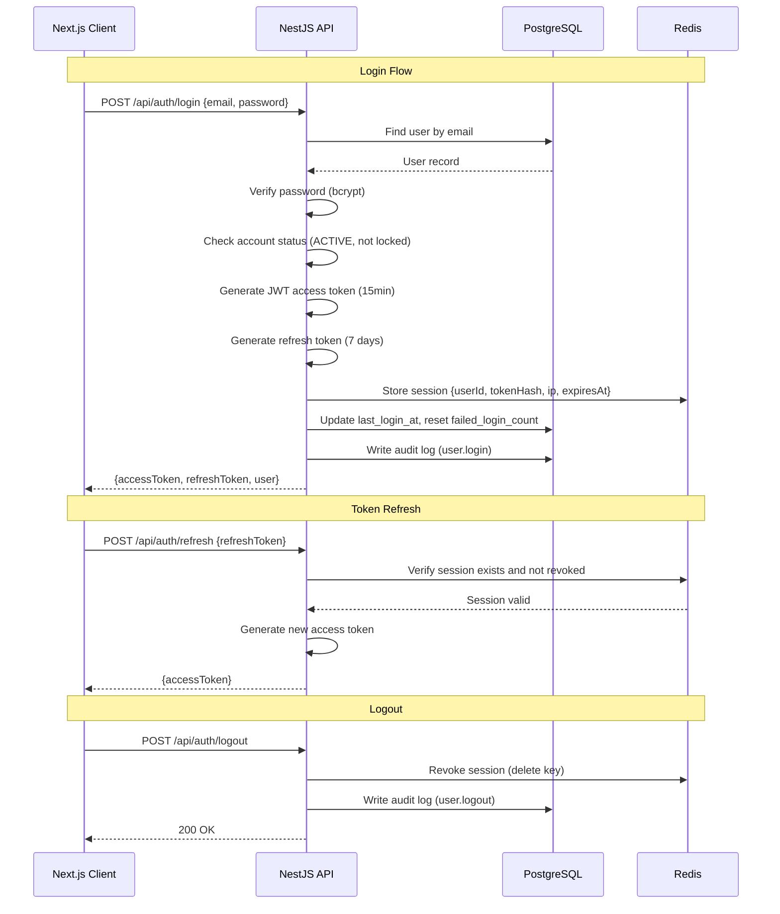
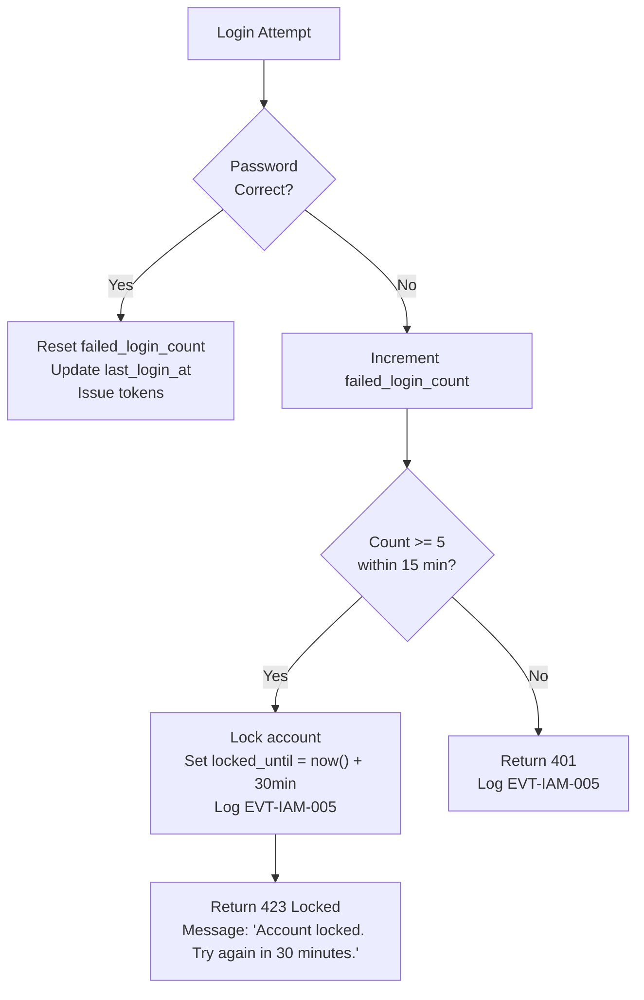

# Authentication Design
## FiberOps PH – FTTH Barangay Multi-JV CRM / OSS-BSS Platform

**Document ID**: AUTH-FOPS-001
**Version**: 1.0
**Date**: 2026-03-07

---

## 1. Authentication Flow



---

## 2. JWT Token Design

### 2.1 Access Token Payload

```json
{
  "sub": "user-uuid-1234",
  "email": "juan@example.com",
  "fullName": "Juan Dela Cruz",
  "roles": ["BARANGAY_MANAGER"],
  "scopeType": "BARANGAY",
  "barangayIds": ["brgy-uuid-1", "brgy-uuid-2"],
  "partnerId": null,
  "iat": 1709827200,
  "exp": 1709828100
}
```

| Claim | Type | Description |
|-------|------|-------------|
| `sub` | UUID | User ID |
| `email` | string | User email |
| `fullName` | string | Display name |
| `roles` | string[] | Assigned role names |
| `scopeType` | enum | GLOBAL, BARANGAY, PARTNER, ASSIGNMENT |
| `barangayIds` | UUID[] | Assigned barangay IDs (empty for global) |
| `partnerId` | UUID? | Assigned partner ID (JV Partner only) |
| `iat` | number | Issued at timestamp |
| `exp` | number | Expiry timestamp |

### 2.2 Token Configuration

| Parameter | Value | Rationale |
|-----------|-------|-----------|
| Access token TTL | 15 minutes | Short-lived for security |
| Refresh token TTL | 7 days | Balances security with usability |
| Signing algorithm | HS256 | Symmetric; single-service deployment |
| Secret rotation | Manual via env var; rotate quarterly | Invalidates all tokens on rotation |
| Token storage (client) | Access: memory; Refresh: httpOnly secure cookie | XSS protection |

### 2.3 Token Refresh Strategy

```
Client interceptor:
  1. Before each API call, check if access token expires within 60 seconds
  2. If expiring, call POST /api/auth/refresh with refresh token cookie
  3. Store new access token in memory
  4. If refresh fails (401), redirect to login
```

---

## 3. Password Security

| Rule | Configuration |
|------|-------------|
| Hashing algorithm | bcrypt (12 rounds) |
| Minimum length | 8 characters |
| Complexity | At least 1 uppercase, 1 lowercase, 1 digit |
| Max login attempts | 5 within 15 minutes → lock for 30 minutes |
| Password reset | Email link with one-time token (1 hour expiry) |
| Password history | Not enforced in Phase 1 |
| Force change on first login | Configurable per user |

### 3.1 Failed Login Handling



---

## 4. Session Management

### 4.1 Redis Session Schema

```
Key:   session:{userId}:{sessionId}
Value: {
  "tokenHash": "sha256-hash-of-refresh-token",
  "ipAddress": "192.168.1.1",
  "userAgent": "Mozilla/5.0...",
  "createdAt": "2026-03-07T10:00:00Z",
  "lastAccessedAt": "2026-03-07T14:30:00Z"
}
TTL: 604800 (7 days)
```

### 4.2 Concurrent Session Policy

| Policy | Value |
|--------|-------|
| Max concurrent sessions per user | 3 |
| When exceeded | Oldest session revoked |
| Force logout | Super Admin can revoke all sessions for any user |
| Session list | User can view their active sessions in Profile |

### 4.3 Session Invalidation Events

| Event | Action |
|-------|--------|
| User deactivated | Revoke all sessions |
| Password changed | Revoke all sessions except current |
| Role changed | Revoke all sessions (force re-login for new permissions) |
| Scope changed | Revoke all sessions |
| Manual force logout | Revoke specified session or all |

---

## 5. API Security Headers

| Header | Value | Purpose |
|--------|-------|---------|
| `Strict-Transport-Security` | `max-age=31536000; includeSubDomains` | Force HTTPS |
| `X-Content-Type-Options` | `nosniff` | Prevent MIME sniffing |
| `X-Frame-Options` | `DENY` | Prevent clickjacking |
| `X-XSS-Protection` | `1; mode=block` | XSS filter |
| `Content-Security-Policy` | Configured per deployment | Prevent injection |
| `Referrer-Policy` | `strict-origin-when-cross-origin` | Limit referrer info |

---

## 6. Rate Limiting

| Endpoint Group | Limit | Window | Key |
|---------------|:-----:|--------|-----|
| `/api/auth/login` | 5 | 1 minute | IP address |
| `/api/auth/forgot-password` | 3 | 5 minutes | IP address |
| `/api/auth/refresh` | 10 | 1 minute | User ID |
| General API (authenticated) | 100 | 1 minute | User ID |
| Bulk operations | 10 | 1 minute | User ID |
| Export endpoints | 5 | 5 minutes | User ID |

Implementation: Redis sliding window via `@nestjs/throttler` with Redis store.

---

## 7. CORS Configuration

```typescript
{
  origin: process.env.ALLOWED_ORIGINS?.split(',') || ['http://localhost:3000'],
  methods: ['GET', 'POST', 'PATCH', 'DELETE'],
  credentials: true, // for httpOnly cookies
  maxAge: 600,       // preflight cache 10 min
}
```
