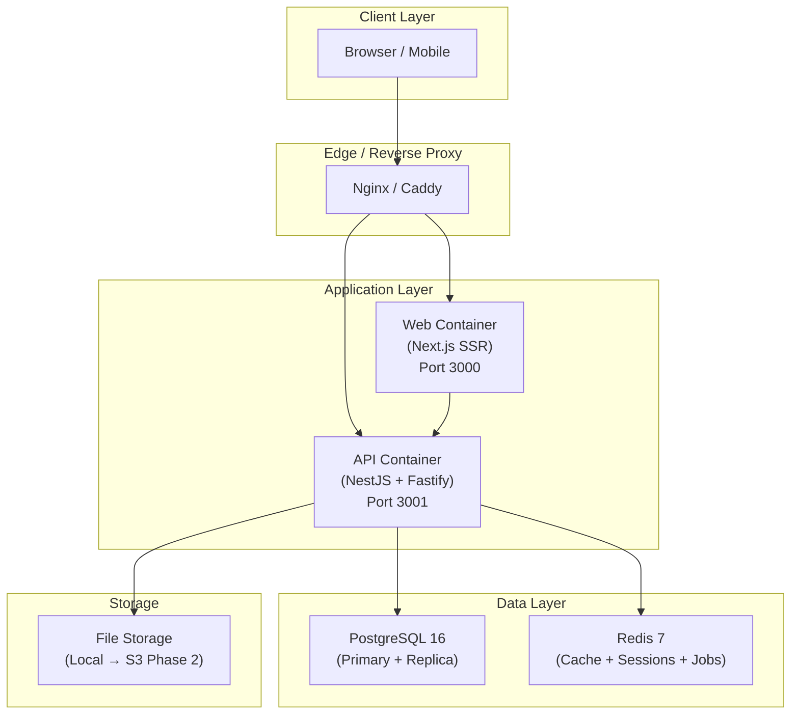

# Deployment Blueprint
## FiberOps PH – Infrastructure & Deployment Architecture

**Document ID**: DEP-FOPS-001
**Version**: 1.0
**Date**: 2026-03-07

---

## 1. Deployment Architecture



---

## 2. Container Specifications

### 2.1 API Container (`docker/Dockerfile.api`)

```dockerfile
# Build stage
FROM node:20-alpine AS builder
WORKDIR /app

# Install pnpm
RUN corepack enable && corepack prepare pnpm@8 --activate

# Copy workspace files
COPY pnpm-lock.yaml pnpm-workspace.yaml package.json ./
COPY packages/ ./packages/
COPY apps/api/ ./apps/api/
COPY prisma/ ./prisma/

# Install dependencies
RUN pnpm install --frozen-lockfile --filter api...

# Generate Prisma client
RUN cd prisma && npx prisma generate

# Build
RUN pnpm --filter api build

# Production stage
FROM node:20-alpine AS production
WORKDIR /app
ENV NODE_ENV=production

RUN corepack enable && corepack prepare pnpm@8 --activate

COPY --from=builder /app/node_modules ./node_modules
COPY --from=builder /app/apps/api/dist ./dist
COPY --from=builder /app/prisma ./prisma
COPY --from=builder /app/apps/api/package.json ./

EXPOSE 3001

HEALTHCHECK --interval=30s --timeout=3s \
  CMD wget -qO- http://localhost:3001/api/v1/health || exit 1

CMD ["node", "dist/main.js"]
```

### 2.2 Web Container (`docker/Dockerfile.web`)

```dockerfile
# Build stage
FROM node:20-alpine AS builder
WORKDIR /app

RUN corepack enable && corepack prepare pnpm@8 --activate

COPY pnpm-lock.yaml pnpm-workspace.yaml package.json ./
COPY packages/ ./packages/
COPY apps/web/ ./apps/web/

RUN pnpm install --frozen-lockfile --filter web...
RUN pnpm --filter web build

# Production stage
FROM node:20-alpine AS production
WORKDIR /app
ENV NODE_ENV=production

COPY --from=builder /app/apps/web/.next/standalone ./
COPY --from=builder /app/apps/web/.next/static ./.next/static
COPY --from=builder /app/apps/web/public ./public

EXPOSE 3000

HEALTHCHECK --interval=30s --timeout=3s \
  CMD wget -qO- http://localhost:3000/api/health || exit 1

CMD ["node", "server.js"]
```

---

## 3. Environment Tiers

| Tier | Purpose | Infra | Database | Updates |
|------|---------|-------|----------|---------|
| **Local** | Developer machine | Docker Compose | PostgreSQL container | Manual |
| **Staging** | Integration testing | VPS or cloud VM | Managed PostgreSQL | Auto (on develop push) |
| **Production** | Live system | VPS cluster or cloud | Managed PostgreSQL (HA) | Manual (tagged release) |

---

## 4. Infrastructure Sizing

### Phase 1 (MVP: 1-5 barangays, < 5,000 subscribers)

| Component | Specification | Est. Cost/mo |
|-----------|-------------|:------------:|
| App Server (API + Web) | 2 vCPU, 4GB RAM, 80GB SSD | ₱2,000-3,000 |
| PostgreSQL | 1 vCPU, 2GB RAM, 40GB SSD | ₱1,500-2,000 |
| Redis | 512MB RAM | ₱500-800 |
| Reverse Proxy | Shared with app server | — |
| Backups | Daily automated, 7-day retention | ₱500 |
| **Total** | | **~₱5,000/mo** |

### Phase 2 (Growth: 10-20 barangays, 5,000-25,000 subscribers)

| Component | Specification | Est. Cost/mo |
|-----------|-------------|:------------:|
| App Server × 2 (load balanced) | 4 vCPU, 8GB RAM each | ₱8,000-12,000 |
| PostgreSQL (HA) | 2 vCPU, 4GB RAM, 100GB SSD + replica | ₱5,000-7,000 |
| Redis (dedicated) | 1GB RAM | ₱1,500 |
| Load Balancer | Cloud LB or HAProxy | ₱1,000-2,000 |
| Object Storage | For file uploads, backups | ₱500-1,000 |
| **Total** | | **~₱18,000/mo** |

---

## 5. Reverse Proxy Configuration (Nginx)

```nginx
upstream api_backend {
    server api:3001;
}

upstream web_frontend {
    server web:3000;
}

server {
    listen 80;
    server_name fiberops.example.com;
    return 301 https://$host$request_uri;
}

server {
    listen 443 ssl http2;
    server_name fiberops.example.com;

    ssl_certificate     /etc/ssl/certs/fiberops.crt;
    ssl_certificate_key /etc/ssl/private/fiberops.key;

    # Security headers
    add_header Strict-Transport-Security "max-age=31536000; includeSubDomains" always;
    add_header X-Frame-Options "DENY" always;
    add_header X-Content-Type-Options "nosniff" always;
    add_header X-XSS-Protection "1; mode=block" always;

    # API routes
    location /api/ {
        proxy_pass http://api_backend;
        proxy_set_header Host $host;
        proxy_set_header X-Real-IP $remote_addr;
        proxy_set_header X-Forwarded-For $proxy_add_x_forwarded_for;
        proxy_set_header X-Forwarded-Proto $scheme;

        # Rate limiting
        limit_req zone=api burst=20 nodelay;
        client_max_body_size 10M;
    }

    # Frontend routes
    location / {
        proxy_pass http://web_frontend;
        proxy_set_header Host $host;
        proxy_set_header X-Real-IP $remote_addr;
    }

    # Static assets caching
    location /_next/static/ {
        proxy_pass http://web_frontend;
        expires 365d;
        add_header Cache-Control "public, immutable";
    }
}
```

---

## 6. Database Operations

### 6.1 Migration Strategy

| Stage | Tool | Command |
|-------|------|---------|
| Development | Prisma | `npx prisma migrate dev --name <description>` |
| Staging | Prisma | `npx prisma migrate deploy` (auto in CI) |
| Production | Prisma | `npx prisma migrate deploy` (manual approval) |

**Rules**:
- Never use `prisma migrate dev` outside local development
- All migrations are forward-only (no rollback scripts)
- Destructive changes (drop column) require a 2-step migration:
  1. Add new column, migrate data
  2. Remove old column in next release

### 6.2 Backup Strategy

| Frequency | Type | Retention | Method |
|-----------|------|-----------|--------|
| Hourly | WAL archives | 24 hours | PostgreSQL continuous archiving |
| Daily | Full dump | 30 days | `pg_dump` compressed |
| Weekly | Full dump | 90 days | `pg_dump` + offsite storage |

### 6.3 Monitoring

| Metric | Alert Threshold | Tool |
|--------|:---------------:|------|
| Database connection pool | > 80% used | pg_stat_activity |
| Query duration | > 2 seconds | Slow query log |
| Disk usage | > 80% | System monitoring |
| Redis memory | > 80% | Redis INFO |
| API response time (p95) | > 500ms | Application logs |
| API error rate (5xx) | > 1% | Application logs |
| Container health | Unhealthy | Docker healthcheck |
| SSL certificate expiry | < 30 days | Monitoring script |

---

## 7. Health Check Endpoint

```typescript
// GET /api/v1/health
@Controller('health')
export class HealthController {
  @Get()
  async check() {
    const checks = {
      status: 'ok',
      timestamp: new Date().toISOString(),
      uptime: process.uptime(),
      version: process.env.APP_VERSION || 'dev',
      services: {
        database: await this.checkDatabase(),
        redis: await this.checkRedis(),
      }
    };
    
    const allHealthy = Object.values(checks.services).every(s => s.status === 'ok');
    return { ...checks, status: allHealthy ? 'ok' : 'degraded' };
  }
}
```

---

## 8. Logging Strategy

| Level | Where | Examples |
|-------|-------|---------|
| ERROR | Persistent log + alert | Unhandled exceptions, DB connection failures |
| WARN | Persistent log | Rate limit hit, degraded service |
| INFO | Persistent log | Request start/end, deployment events |
| DEBUG | Dev only | Query details, cache hits/misses |

**Log format** (structured JSON):
```json
{
  "level": "info",
  "message": "Request completed",
  "timestamp": "2026-03-07T14:30:15.123Z",
  "correlationId": "abc-123",
  "method": "POST",
  "path": "/api/v1/billing/payments",
  "statusCode": 201,
  "duration": 145,
  "userId": "user-uuid",
  "barangayId": "brgy-uuid"
}
```
